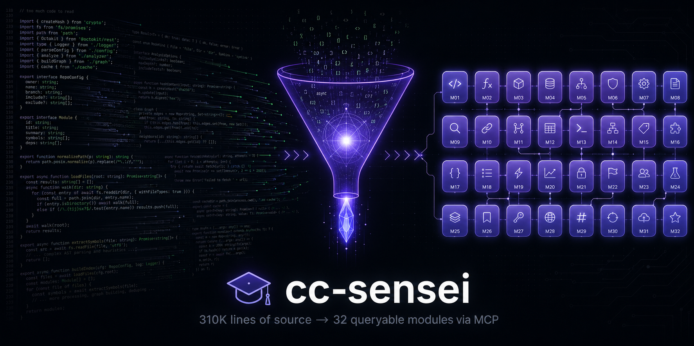

<div align="center">

# 🎓 cc-sensei

### *把 Claude Code 的全部架构智慧，装进你 AI 的脑子里*

[](https://modelcontextprotocol.io/)
[](#测试)
[](#深入了解)
[](#性能)
[](LICENSE)



</div>

---

## 你是不是也有这些烦恼？

> 😩 **"我已经深扒了 Claude Code 源码，但让 AI 帮我搭 Agent 时，AI 完全不知道我在说什么——我读过的它没读过。"**

> 😫 **"我也想做个知识库让 AI 学 Claude Code，可一打开发现 30 万+ 行源码、1250 个文件，我和 AI 都直接被劝退。"**

> 😵 **"我连 Claude Code 源码都没怎么看过，但我也想拥有一个和它一样强大的 Agent——这要怎么开始？"**

如果你中了任意一条 —— **这个项目就是为你写的。**

---

## 它能为你做什么

**cc-sensei 把 Claude Code 的 31 万行源码、1250 个文件，提炼成了 32 个核心模块、4 万行结构化分析，并通过 MCP 协议直接喂给你的 AI。**

涵盖了 Claude Code 全部核心能力：
> 🔁 Agent 主循环引擎 · 🛠️ Tool 系统与执行管线 · 🛡️ 权限与安全沙盒 · 🌊 模型 API 与流式处理
> 🧠 上下文工程与压缩 · 📂 文件 / Shell / Git 工具 · 🔌 MCP 协议实现 · 🎨 Ink 渲染引擎 · 🧩 Skills/插件系统
> 💾 持久化记忆 · ⚡ Prompt cache 破裂检测 · 🤖 子 Agent 与任务系统 ……（共 22 核心 + 10 深度补充）

打通了一条**自然语言 → 模块 → 设计决策 → 可复用 pattern → 对应源码**的全链路索引：

```
       你说一句话                      Oracle 自动做这五件事
  ─────────────────────         ───────────────────────────────────
  "怎么压缩长会话？"   ───►   ① 自然语言匹配到 M06 上下文工程
                              ② 给出 4 层压缩架构、9-section 摘要 prompt
                              ③ 列出可直接抄的 5 条工程精髓
                              ④ 跨模块追踪 prompt cache 影响的 12 个模块
                              ⑤ 直接拉出 services/compact/microCompact.ts 源码
```

接入到 Claude Desktop / Cursor / Qoder / 自研 Agent 之后，**你的 AI 就拥有了一位「Claude Code 总架构师」当顾问**——不管你是要照着造一个，还是只想偷一段设计，它都能精确告诉你**"看哪里"、"为什么"、"怎么抄"**。

让你的 AI 一夜之间，成为世界顶尖的 Agent 开发大师。

---

## 🚀 快速开始（3 步搞定）

### 第 1 步 — 下载项目

打开终端，复制粘贴这一行：

```bash
git clone https://github.com/contradictory-body/cc-sensei.git && cd cc-sensei
```

### 第 2 步 — 安装并构建

继续复制粘贴：

```bash
pnpm install && pnpm build
```

> 💡 没装 pnpm？先来一行：`npm install -g pnpm`
> 💡 这一步会自动解析 32 份模块分析、生成知识索引、编译服务。**只需要做一次。**

完成后你应该看到：`✅ module-registry.json (32 modules)` 和 `✅ Build success`。

### 第 3 步 — 接入你的 AI

在你的 MCP 客户端配置文件里加这一段（**记得把路径换成你刚才 clone 的实际路径**）：

```json
{
  "mcpServers": {
    "cc-sensei": {
      "command": "node",
      "args": ["/你的电脑上的绝对路径/cc-sensei/dist/server.js"]
    }
  }
}
```

不知道配置文件在哪？常见位置：
| 客户端 | 配置文件路径 |
|---|---|
| **Claude Desktop（macOS）** | `~/Library/Application Support/Claude/claude_desktop_config.json` |
| **Claude Desktop（Windows）** | `%APPDATA%\Claude\claude_desktop_config.json` |
| **Cursor** | 设置 → MCP → 添加新服务器 |
| **Qoder** | 设置 → MCP → 编辑 mcpServers |

**重启客户端，搞定！** 你的 AI 现在多了 6 个新技能。

### 🎯 第一次试试看

直接对你的 AI 说：

> *"用 cc-sensei 告诉我，Claude Code 是怎么做 prompt cache 优化的？"*

它会自己调用工具，给你一份带源码引用的完整解析。**就这么简单。**

---

## 深入了解

### 🛠️ 6 个工具能做什么

| 工具 | 一句话能力 | 什么时候用 |
|---|---|---|
| **`list_modules`** | 列出全部 32 个模块 + 各自 concern | "Claude Code 都拆了哪些模块？" |
| **`query_architecture`** | 自然语言搜索 + 三档深度（brief/standard/deep） | "他们怎么解决长会话上下文爆炸？" |
| **`get_module`** | 钻取单模块的某一类 section（responsibility / architecture / decisions / principles / relations） | "M06 的设计原则给我看看" |
| **`trace_concern`** | 跨 32 个模块追踪一个 concern，按命中数排序 | "'prompt cache' 涉及哪些模块？" |
| **`search_patterns`** | 批量提取可复用 pattern，自动限流防爆 | "给我所有 cache 相关的可抄设计" |
| **`get_source_code`** | 直接读 Claude Code 源码（带行号、行范围、目录列表） | "showme `services/api/claude.ts:1412-1456`" |

每个工具都内置：
- ✅ **路径前缀容错** — `src/...` 和无前缀都接受，不再因为复制粘贴报错
- ✅ **结果限流** — 默认每段 800 字符、共 12 段，避免把你的 AI 上下文炸掉
- ✅ **路径穿越拦截** — `../../../etc/passwd` 这类攻击直接 reject
- ✅ **优雅降级** — 错误参数都给友好提示而不是崩溃

---

### 🎬 真实场景：「我要给我的 Agent 加上下文压缩」

```
你：    "如何在长会话中压缩历史以避免超出 token 上限？"

Oracle (query_architecture, 103ms):
  → 命中 M06: 上下文工程
  → 给出 4 层压缩架构对比表（microCompact / sessionMemoryCompact /
    autoCompact / reactiveCompact）
  → 触发条件、是否调 LLM、关键文件位置全部列清

你：    "M06 的关键设计原则给我看看"

Oracle (get_module section=principles, 102ms):
  → "Sticky-on Beta Headers — 性能 > 简洁"
    "单 message-level cache_control marker（最多 4）"
    "9-section 摘要结构 — eval-driven prompt"
  → 每条原则附带：体现位置、代码片段、为什么、复用方式、代价

你：    "'prompt cache' 跨多少模块？"

Oracle (trace_concern, 118ms):
  → 12 个模块按命中数排序
  → 每模块给出 5 行 file:line 摘录

你：    "把 src/services/compact/microCompact.ts 给我看"

Oracle (get_source_code, 99ms):
  → 直接源码 + 行号 + 文件总行数
```

**一个完整的"理解 → 抄作业 → 落地"链路，平均 ~110ms。**

---

### 📦 知识规模

```
📚 32 个模块分析  (4 万行精炼总结，覆盖 31 万行源码)
├── M01-M22  核心模块
│   M01 进程引导与生命周期 · M02 Agent 主循环引擎 · M03 Tool 系统
│   M04 权限与安全 · M05 模型 API 与流式处理 · M06 上下文工程
│   M07 文件/Shell/Git 工具 · M08 MCP 协议实现 · M09 LSP 集成
│   M10 Bridge/IPC 通信 · M11 Ink 渲染引擎 · M12 消息渲染层
│   M13 输入系统 · M14 子 Agent 与任务系统 · M15 Skills/插件系统
│   M16 命令系统 · M17 配置与设置 · M18 遥测与分析
│   M19 状态管理 · M20 快捷键与焦点 · M21 Buddy/语音 · M22 可测试性架构
└── SUPP-* 10 个深度补充
    AgentSummary · SessionMemory · autoDream · 彩色 Diff
    记忆提取 · 文件索引 · 大文件处理 · 推测执行
    团队记忆同步 · Yoga 布局引擎

🗂️ 索引：390 个关键词 / 104 个 concern / 全部 section 行号映射
💻 完整源码：claude-code-main/src/  随时本地直读
```

---

### 🏗️ 工程哲学

这个项目本身就是 **dogfooding** —— 用 Claude Code 教的方法，造给 Claude 用的工具。

| Claude Code 的设计哲学 | 本项目的应用 |
|---|---|
| **Build-time 索引 + Runtime 零分析** | 所有 section 行号、关键词、concern 在 `pnpm build:index` 阶段算完，runtime 只查 JSON |
| **路径穿越守门** | `validatePath` 在每次文件读取前必过 |
| **优雅降级 > 异常崩溃** | 找不到 section？返回"可用类型清单" |
| **结构化 prompt-as-spec** | 32 份 MODULE_NOTES 严格按 10 节模板写 |
| **限流是默认行为** | search_patterns 默认每段 800 char、12 段封顶，可调 |

---

### ⚡ 性能

```
p50 = 105ms   p95 = 118ms   max = 125ms
平均响应大小：7K 字符
完全本地，0 网络依赖
```

---

### ✅ 测试

```bash
pnpm exec tsx scripts/test-suite.ts          # 30 项基础功能测试
pnpm exec tsx scripts/regression-3fixes.ts   # 11 项体验修复回归
pnpm exec tsx scripts/e2e-comprehensive.ts   # 24 项真实场景端到端
```

| 测试套件 | 用例 | 结果 |
|---|---|---|
| 基础功能（6 工具 × 多分支） | 30 | ✅ 30/30 |
| 体验问题修复回归 | 11 | ✅ 11/11 |
| 真实用户场景端到端（3 persona） | 24 | ✅ 24/24 |
| **合计** | **65** | **✅ 65/65** |

---

### 📁 项目结构

```
cc-sensei/
├── src/
│   ├── server.ts                 # MCP server 入口
│   ├── retrieval/engine.ts       # 检索引擎
│   ├── source-reader.ts          # 源码读取 + 路径安全
│   ├── taxonomy.ts               # 32 模块映射表
│   └── tools/                    # 6 个 MCP 工具
├── scripts/
│   ├── build-index.ts            # 解析 MODULE_NOTES 生成索引
│   ├── test-suite.ts
│   ├── regression-3fixes.ts
│   └── e2e-comprehensive.ts
├── knowledge/                    # build 产物
│   ├── module-registry.json
│   ├── keyword-index.json
│   └── concern-map.json
├── claude-code-main/             # Claude Code 源码 + 32 份模块分析
│   ├── src/                      #   ← 源码
│   └── MODULE_NOTES/             #   ← 模块分析
└── dist/server.js                # 打包产物
```

---

### ⚙️ 高级配置

| 环境变量 | 作用 | 默认 |
|---|---|---|
| `CC_SOURCE_ROOT` | Claude Code 源码根目录 | `<项目>/claude-code-main/src` |
| `MODULE_NOTES_ROOT` | 模块分析目录 | `<项目>/claude-code-main/MODULE_NOTES` |

把这两个指到任意位置，就可以**让 Oracle 替你解析任何项目**——只要那个项目按相同的 MODULE_NOTES 模板写过分析。

---

## Roadmap

- [ ] 增量索引（只重算改动过的 MODULE_NOTES）
- [ ] section 类型扩展（performance / security / observability 三类）
- [ ] HTTP / SSE 传输（除了 stdio 之外）
- [ ] 多 codebase 支持（同时挂多个项目）

---

## License

MIT

---

<div align="center">

**31 万行源码看不完？让 4 万行精炼分析替你看，让 AI 替你抄。**

如果它帮到了你，给个 ⭐ 让更多 Agent 开发者看到。

</div>
