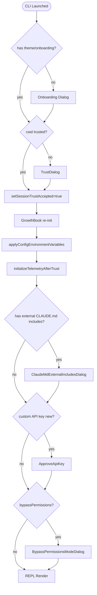

# M01 进程启动与生命周期

## 1. 模块定位

负责把"用户在终端敲下 `claude`"变成"准备好接收第一条消息的 REPL/print"。覆盖:
- 进程级常量 / 环境检测
- 配置加载与迁移
- 一次性向各个子系统派发"启动事件"
- 把 ~135ms 的同步 import 与 keychain/MDM/keytab 的 IO 时间重叠
- Trust 对话 / 设置错误 / API key 二次确认等启动期 UI
- 终止流程(graceful shutdown / cleanup registry)

## 2. 关键文件

- `src/entrypoints/cli.tsx`
  - 作用:进程的真正 bootstrap 入口。**完全用动态 import**,只在最快路径(`--version` / `--dump-system-prompt` / `--daemon-worker` / `mcp serve` / `bridge` 等)上做最少的工作就退出
  - 关键函数:`main()`(快路径分发) → `import('./main.js').then(m => m.main())`
  - 关键设计:**fast-path 退出**(零依赖)、**lazy import 全开**

- `src/main.tsx` (4683 行)
  - 作用:Commander.js 命令树定义、参数解析、`run()` 调用、所有子命令的 action 处理
  - 关键函数:`main()`(顶层)、`run()`(Commander 主程序)、子命令 `mcp/auth/plugin/server/ssh/open/setup-token/agents/auto-mode/remote-control/assistant/doctor/update/up/rollback`
  - 关键设计:
    - 顶部 19 行**强制 side-effect**:`profileCheckpoint('main_tsx_entry')` → `startMdmRawRead()` → `startKeychainPrefetch()`
    - `program.hook('preAction')` 内 `Promise.all([ensureMdmSettingsLoaded(), ensureKeychainPrefetchCompleted()])` 阻塞等待并行预取
    - **MACRO.VERSION** 是构建期内联宏(便于 fast-path)
    - **`feature()`** = 构建期常量,死码消除

- `src/entrypoints/init.ts` (340 行)
  - 作用:`init = memoize(async () => …)` ⇒ 幂等的"启动序列"
  - 关键步骤(顺序):`enableConfigs` → `applySafeConfigEnvironmentVariables` → `applyExtraCACertsFromConfig` → `setupGracefulShutdown` → 1P event logging dynamic import → OAuth populate → JetBrains detect → repo detect → `initializeRemoteManagedSettingsLoadingPromise()` → `recordFirstStartTime` → `configureGlobalMTLS` → `configureGlobalAgents` → `preconnectAnthropicApi`(TLS warm) → `setShellIfWindows`
  - **catch 内**:`ConfigParseError` 走 `InvalidConfigDialog`(动态 import,避免启动期 React 加载)

- `src/bootstrap/state.ts` (1758 行)
  - 作用:**进程级单例 STATE**,提供 ~85 个 getter/setter
  - 关键设计:
    - 顶部注释:**"DO NOT ADD MORE STATE HERE - BE JUDICIOUS WITH GLOBAL STATE"**
    - 文件级 `const STATE: State = getInitialState()` —— 全局变量但只读访问受 export 控制
    - 所有可变 state 通过具名 setter,配合 `createSignal()` 暴露订阅(如 `onSessionSwitch`)
    - 包含:cwd / projectRoot / 累计统计 / model usage / OTel handles / agent color map / 最后一次 API 请求 / scheduled tasks / sessionId / 各类 session-only flags(trust / persistence / plan-mode-exit / lsp-recommendation-shown / ...)

- `src/setup.ts` (~600 行)
  - 作用:第一次进入 REPL 之前的"用户级会话准备"
  - 关键内容(从 imports 推断):`initSinks`、`initSessionMemory`、`getCommands`、释放点 / 终端备份恢复 / 配置项识别 / hook config 快照 / 文件变更监听器初始化

- `src/replLauncher.tsx` (~22 行)
  - 作用:**纯转发**;`launchRepl(root, appProps, replProps, renderAndRun)` 内部 `await import('./components/App.js')` + `await import('./screens/REPL.js')` 然后 `renderAndRun(root, <App><REPL /></App>)`
  - 关键设计:**REPL 与 App 的 import 都是 lazy** —— 直到此刻 React/Ink 树才进入内存

- `src/interactiveHelpers.tsx` (~2000 行,57K 字节)
  - 作用:`renderAndRun`、`exitWithError`、`showSetupDialog`、`showSetupScreens`、各种"在 root 上短暂渲染对话框然后 unmount"的工具
  - `renderAndRun` 体非常简单:`root.render → startDeferredPrefetches → root.waitUntilExit → gracefulShutdown(0)`
  - `showSetupScreens` 是启动期模态序列:`Onboarding → TrustDialog → MCP server approvals → CLAUDE.md include warning → Grove(政策弹窗) → ApproveApiKey → BypassDangerousMode → ...`

- `src/migrations/migrate*.ts` (11 个文件)
  - 每个迁移是一个无副作用的"`(config) → config`"函数,被 `runMigrations()` 在 `CURRENT_MIGRATION_VERSION` 升级时按序执行
  - 例:`migrateSonnet1mToSonnet45.ts`、`migrateLegacyOpusToCurrent.ts`、`migrateBypassPermissionsAcceptedToSettings.ts`

## 3. 核心抽象

### 3.1 启动管线(三层)
```
cli.tsx (fast path)          ← 零依赖快路径
  └→ main.tsx::main()        ← argv 解析、cc:// rewrite、deep link
       └→ Commander.run()    ← 命令树
            └→ preAction:    ← Promise.all(MDM, keychain) → init()
                 ↓
                 init.ts::init()    ← memoize'd, 子系统级初始化
                 ↓
            action handler:  ← setup() → showSetupScreens() → launchRepl()
                                 ↓
                                 launchRepl → renderAndRun(<App><REPL/></App>)
                                 ↓
                                 root.waitUntilExit + gracefulShutdown
```

### 3.2 启动期"并行预取"模式
- **入口:** main.tsx 的 import 副作用(line 12-20)就启动 `startMdmRawRead()` / `startKeychainPrefetch()`
- **同步:** preAction 用 `Promise.all([ensureMdmSettingsLoaded(), ensureKeychainPrefetchCompleted()])` 等待
- **意图:** 用 ~135ms 的同步 import 时间窗,把进程外 IO(plutil / reg query / keychain access)的耗时藏掉
- **效果:** 同步 keychain 调用耗时(~65ms)→ 0(被并行)
- **抽象成可复用模式 → "import-time prefetch + preAction barrier"**

### 3.3 `init()` 的幂等保证
- 用 `memoize(async () => …)` 包裹 ⇒ 多入口都能调用而不会重复
- 子命令(doctor / mcp / plugin / auth)都通过 preAction 触发同一个 init
- 但是子系统只在第一次 init 真正执行(如 `void initializeFirstPartyEventLogging()`)

### 3.4 进程级 STATE 的边界
- `bootstrap/state.ts` 是被 lint rule(`custom-rules/bootstrap-isolation`)保护的"叶子模块"
- 所有外部模块通过 `getXxx()` / `setXxx()` 函数访问,不直接 import 对象
- 这种设计的**实际效果**:
  - 任何 hot-reload(测试中 `resetStateForTests()`)只需重置一份 state
  - 没有循环依赖风险(不允许 state 反向 import 业务模块)
  - 所有可观察事件用 `createSignal()` 推出去(订阅模式)
- 这个文件 = "App 的全局 process-level Redux store"

### 3.5 启动期 setup 屏幕的状态机

所有这些对话框都通过同一抽象 `showSetupDialog<T>(root, renderer)` 创建并自动 unmount,等价于"协程级模态"。

### 3.6 Migration 的契约
- 每个 migration 是 `(config) → newConfig` 纯函数
- `CURRENT_MIGRATION_VERSION` 单调递增
- 升级时按 `oldVersion → CURRENT_MIGRATION_VERSION` 顺序应用
- 失败一致性:整个流程失败则不写回(避免半升级)
- 命名规范:`migrate<From>To<To>.ts`,例如 `migrateSonnet45ToSonnet46.ts`

## 4. 数据流 / 控制流

### 4.1 输入
- `process.argv` / `process.env`
- 配置文件:user / project / local / managed / policy / SDK 注入(共 ~6 来源)
- 历史会话文件、记忆文件、agents 目录、skills 目录、plugins 目录

### 4.2 输出
- React/Ink root.render() 在交互模式
- stdout 在 `--print` 模式
- 新进程在 `mcp serve` / `daemon-worker` / `bridge` 等子命令

### 4.3 关键时序
1. **module evaluation phase**(同步): import 阶段触发 `startMdmRawRead`、`startKeychainPrefetch`、各种 `process.title` / 错误处理注册等
2. **main() 同步阶段**: 解析 argv、SIGINT 注册、`process.env.NoDefaultCurrentDirectoryInExePath = '1'`(Windows PATH 劫持防护)、deep link / cc:// URL 处理
3. **Commander preAction**: 等待并行预取 + 调用 init() + initSinks + runMigrations + 远程 settings(非阻塞)
4. **action handler**: 解析 options、设置 model/effort/agent、setup()、showSetupScreens()
5. **launchRepl**: 动态 import App + REPL,渲染
6. **REPL 内部 useEffect**: 真正开始接受用户输入

### 4.4 异步 / 并发 / 取消
- 所有"非阻塞 prefetch"都是 `void Promise.then(...)` 模式 —— **不 await,不 catch**(失败会被全局 unhandled rejection handler 兜底)
- 所有"必须先于 init 完成"的预取都是 import-time side effect + preAction await barrier
- 取消:启动期没有取消,但有 `gracefulShutdownSync(exitCode)` 用于 fast-fail

### 4.5 错误处理
- 启动期 `ConfigParseError` 在交互模式下走 React 渲染(`InvalidConfigDialog`),非交互直接 stderr + exit
- 其他启动错误 throw,被 process.on('uncaughtException') 兜底
- `setupGracefulShutdown()` 注册 SIGTERM/SIGINT/exit 处理器,会 flush:OTel / 1P logger / sessions / scheduled tasks 等

## 5. 工程设计精髓

### 原则 1:启动期是性能契约,import 顺序不可逆
- **Claude Code 中的体现**:`main.tsx` 顶部 19 行用 `// eslint-disable-next-line custom-rules/no-top-level-side-effects` 强制三个 side-effect 的顺序,不允许 lint 自动重排(`biome-ignore-all assist/source/organizeImports`)
- **代表文件**:`src/main.tsx:1-19`、`src/entrypoints/cli.tsx`(整个文件都是 fast-path 排序)
- **为什么重要**:启动期看似平淡,实际所有耗时操作能并行就并行,不能并行就用 lazy import 推迟。每节省 50ms,对 CLI UX 都是巨大的赢
- **复用方式**:对自研 Agent,把"必须的初始化"分成三类:
  1. **必须同步**(读 argv、设关键 process.env、注册 fatal handler)→ 顶部
  2. **能并行 IO**(读文件、子进程)→ import-time fire,在 barrier 处 await
  3. **重模块、概率不需要**(OTel、React、bridge 客户端)→ lazy `await import()`
- **代价**:Lint rule 维护成本;`feature()` 死码消除依赖于 Bun

### 原则 2:进程级 STATE 用单一文件 + 函数封装
- **体现**:`bootstrap/state.ts` 1758 行,但 `STATE: State` 只是一个本地 const,所有访问只能通过 export 出去的 `getXxx/setXxx`
- **代表文件**:`src/bootstrap/state.ts`
- **为什么重要**:Agent CLI 必然要持有"会话级、进程级、可变"的状态(累计成本、tokens、当前 model、cwd)。React state 撑不住(被销毁),环境变量太脆。集中到一个文件 + 函数访问可以:
  - 控制可见性
  - 测试时 reset(`resetStateForTests()`)
  - 避免循环 import
  - 用 `createSignal()` 把"事件"暴露出去
- **复用方式**:自研 Agent 也建一个 `bootstrap/state.ts`,顶部明确注释 "DO NOT ADD MORE STATE HERE",所有 setter 经过函数,不直接暴露对象
- **代价**:只能在 Node 进程内有效;多进程要用 file-backed / IPC 同步

### 原则 3:用 memoize 把"看似事件、实际幂等"的初始化包起来
- **体现**:`init = memoize(async () => …)` —— 即便每个子命令都调一次也只跑一次
- **代表文件**:`src/entrypoints/init.ts:57`
- **为什么重要**:CLI 多个 entry point(默认命令、子命令、daemon worker)都要 init,但是它们独立路径上调用 `init()` 时不能重复执行
- **复用方式**:任何"全局副作用 + 幂等"的函数都可以 `memoize`(甚至无参 fn,memoize 缓存返回值)
- **代价**:在 reset/test 场景需要 `init.cache.clear?.()`(state.ts 的 reset 已经做了)

### 原则 4:命令路由在 Commander.js 内,不要自己写
- **体现**:`run()` 创建 `program = new CommanderCommand()`,然后子命令链式 `.command('mcp').command('serve').action(…)`,深嵌套但是稳定
- **代表文件**:`src/main.tsx:884-` (`run()`)
- **为什么重要**:
  - 子命令的 `--help` 自动生成
  - flag 类型推断由 `extra-typings` 提供
  - `preAction` hook 是个好的注入点
  - hideHelp() 隐藏内部命令
- **复用方式**:用 `commander` + `extra-typings`,不要自己 parse argv(对自研 Agent 要支持 `--print` / `--debug` / `--config-from-stdin` 等多种触发,Commander 是最快的路线)
- **代价**:bundle 大小

### 原则 5:fast-path 退出(零依赖)
- **体现**:`cli.tsx` 检测 `--version` / `--dump-system-prompt` / `mcp serve`(等)立即退出,不 import main.tsx 也不 import config
- **代表文件**:`src/entrypoints/cli.tsx:33-130`
- **为什么重要**:`--version` 应该在 < 50ms 内返回;`mcp serve` 在 IDE 中频繁 spawn,不需要 React/Ink 的开销
- **复用方式**:任何"agent CLI 内部子进程通信"都应该 fast-path,避免 SDK/UI 的加载
- **代价**:fast-path 的代码不能复用 init() 的能力(必须自带 `enableConfigs()`)

### 原则 6:启动期模态序列用 `showSetupDialog` 抽象
- **体现**:`showSetupDialog<T>(root, renderer)` 把"暂时渲染、等结果、unmount"做成 Promise<T>
- **代表文件**:`src/interactiveHelpers.tsx:86`
- **为什么重要**:Onboarding/Trust/ApproveApiKey 这些都是"阻塞下一步"的 UI 事件,如果不抽象 Promise 化,启动流程会变成回调地狱
- **复用方式**:任何 TUI / GUI Agent 都应该把模态对话框做成 `Promise<Result>`(类似浏览器 `window.confirm`,但是异步)
- **代价**:Ink 渲染上下文的初始化和 unmount 有微小开销

### 原则 7:Trust 是一切其他能力的前置
- **体现**:`showSetupScreens` 严格按照"先 trust 后 env vars 后 telemetry"的顺序;CLAUDE.md 必须等 trust 才能 inject;assistant 模式必须等 trust 才能开
- **代表文件**:`src/interactiveHelpers.tsx:104-260`
- **为什么重要**:本地 Agent 一旦默认信任当前目录,会被攻击者"用 README 钓鱼"。Claude Code 把 trust 提到非常高的优先级 —— 哪怕已经 trust 过别的目录,新目录还要再次确认
- **复用方式**:自研 Agent 必须有 trust boundary,且其他危险能力(执行 shell、读 secrets、自动 commit)都受 trust gate
- **代价**:UX 上多一步确认

### 原则 8:把所有必要 cleanup 注册到一个 registry
- **体现**:`registerCleanup(shutdownLspServerManager)`、`registerCleanup(async () => cleanupSessionTeams())`,统一在 `gracefulShutdown` 中调用
- **代表文件**:`src/utils/cleanupRegistry.ts`(不可见,但被广泛 import)
- **为什么重要**:避免每个子系统自己写 SIGINT 处理器(竞争 / 重复)
- **复用方式**:Agent 进程必然产生若干"需要清理"的资源(LSP server / Bridge socket / temp dir / scratchpad)。集中注册到 registry 然后 graceful shutdown 一并跑
- **代价**:cleanup 必须幂等

### 原则 9:用 feature() 把"实验性 / ant-only"代码 DCE 掉
- **体现**:每个 conditional require 包在 `if (feature('KAIROS')) { … }` 里;Bun 在构建期把整个 if-block 移除
- **代表文件**:`src/main.tsx:76-81`、`src/tools.ts:25-50`、几乎所有 services/* 的 reactive feature
- **为什么重要**:bundle 大小直接影响 npm install / 启动 / 内存占用;实验性代码不应该进 prod
- **复用方式**:用 `process.env.NODE_ENV` 的 if 也能做(esbuild/Bun 都会 DCE),但是 `feature()` 提供更精细的标记
- **代价**:打包工具特定;调试不友好

### 原则 10:配置版本迁移用单调递增 `MIGRATION_VERSION`
- **体现**:`CURRENT_MIGRATION_VERSION = 11`,`runMigrations()` 顺序执行
- **代表文件**:`src/main.tsx:325` + `src/migrations/`
- **为什么重要**:用户的 config 文件会跨版本积累,直接在 schema 里"接受 unknown field"会让旧字段污染新字段
- **复用方式**:任何持久化配置/状态的工具都应该有 versioned migration
- **代价**:每次需要写迁移函数

### 原则 11:把"危险能力"放在 `feature()` + `process.env.USER_TYPE === 'ant'` 双 gate
- **体现**:`tools.ts:18`(REPL Tool)、`tools.ts:21`(SuggestBackgroundPRTool)
- **为什么重要**:即便你打开了某个 feature(运行时 GrowthBook),还要 USER_TYPE 才能拿到这个 tool
- **复用方式**:对开发者用工具,`process.env.AGENT_DEV === 'true'` + feature flag 双锁

## 6. 错误处理与边界条件

### 6.1 启动期错误的优先级
1. **CLI 参数错误** → Commander 自动报错并 exit(InvalidArgumentError)
2. **ConfigParseError** → InvalidConfigDialog (交互) / stderr (非交互)
3. **Trust dialog 拒绝** → exit
4. **Network not available** (preconnect 失败) → 不阻塞,继续启动
5. **Remote managed settings 加载失败** → fail-open(继续,不应用)
6. **Plugin 加载失败** → 单插件 isolated,其他正常

### 6.2 SIGINT/SIGTERM
- 顶部 `process.on('SIGINT', ...)` 在 print 模式下"放行"(给 print.ts 自己处理)
- 否则直接 `process.exit(0)`
- `setupGracefulShutdown()` 接管 SIGTERM,触发 cleanup registry

### 6.3 警告处理
- `initializeWarningHandler()` 在 main 入口最早期注册,把 Node warnings 折叠成 debug 日志,避免污染 TUI

## 7. 可迁移设计清单

| 可迁移设计 | 适用场景 | 复用方式 | 风险 |
|---|---|---|---|
| import-time IO 预取 + preAction barrier | 任何启动有冷依赖(凭证、设置、网络)的 CLI | 把 prefetch 拆成 `start()` + `ensure()` 一对函数 | lint 规则要保护顺序 |
| 进程级 STATE 单文件 + getter/setter | 需要全局可变状态的 Node 进程 | 注释 + lint rule 防止扩张 | 测试要 reset |
| memoize'd init() | 多入口共享同一个昂贵初始化 | `memoize(async () => …)` | 测试要 cache.clear |
| Fast-path 退出 | 频繁被 spawn 的子进程 / `--version` | cli.tsx 顶部硬编码分支 | 重复实现 enableConfigs |
| `showSetupDialog<T>` 模态 Promise | 启动期序列模态 | 任意 React tree 都可以包 | 与全局 keybinding 注意冲突 |
| Trust gate 优先级最高 | 敏感能力的 Agent CLI | 强制在能力初始化前确认目录 | UX 多一步 |
| cleanupRegistry | 多子系统的资源回收 | `registerCleanup(async () => ...)` | cleanup 必须幂等 |
| `feature()` 死码消除 | 实验性 / 私有特性 | bun:bundle 或 esbuild define | 打包工具绑定 |
| MIGRATION_VERSION + per-version migration | 跨版本演进的配置 | 单调递增 + 幂等迁移函数 | 测试每个迁移 |

## 8. 待确认问题

1. `setup.ts` 详细逻辑 —— 文件是 600 行但 import 数量很多,先掌握"出现在 main.tsx 中的 setup() 调用入口"即可
2. `cleanupRegistry.ts` 的具体实现 —— 在 utils/ 下不可见
3. `gracefulShutdown` 失败的回退路径(假设 cleanup 阶段 throw)
4. settings sync(`UPLOAD_USER_SETTINGS`)的实际产物
