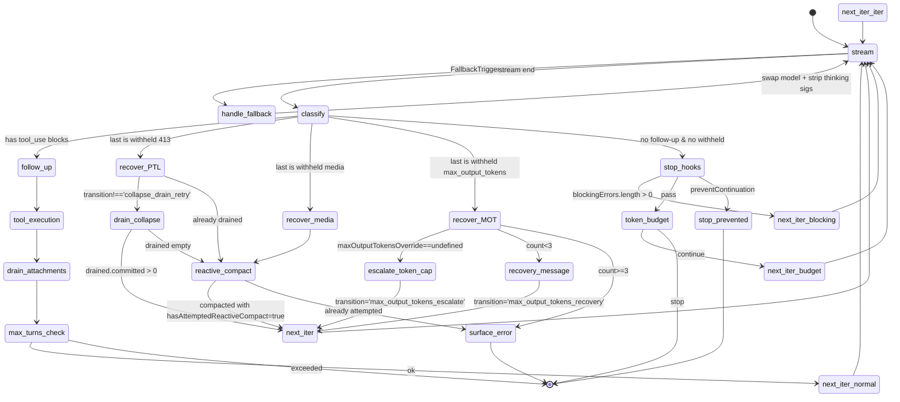

# M02 Agent 主循环

## 1. 模块定位

负责把"用户的一条 prompt"转化成"模型若干轮 sample → tool_use → tool_result → 再 sample"的对话循环,直到达到终止条件(模型自然结束 / 用户中断 / 超出 maxTurns / 超出 budget / 不可恢复错误)。覆盖:

- **会话级控制器**:`QueryEngine` 类,跨多次 `submitMessage()` 持有 `mutableMessages`、`abortController`、`totalUsage`、`readFileState`、`permissionDenials`
- **单轮循环**:`query()` AsyncGenerator,内部封装 `queryLoop()` while-true,每次迭代是一次"模型采样 + 工具执行"
- **四级上下文裁剪管线**:snip → microcompact → contextCollapse → autocompact(顺序不可换,各自有"边界条件")
- **多层错误恢复**:streaming fallback → withheld errors → collapse drain → reactive compact → max_output_tokens recovery
- **多轴预算约束**:`maxTurns` / `maxBudgetUsd` / `taskBudget` / `tokenBudget` / `maxOutputTokensRecovery` 五种独立的"停止条件"
- **Tool 执行编排**:并发 / 串行分桶,`isConcurrencySafe` 决定可否并行
- **Streaming tool execution**:工具在模型仍在流式输出 tool_use 时就开始执行,缩短端到端时延
- **延迟隐藏**:memory / skill prefetch、tool use summary、posSamplingHooks 都用"开始时 fire,结束时 consume"模式

## 2. 关键文件

- `src/QueryEngine.ts` (1295 行)
  - 作用:**会话级状态机**。一个 `QueryEngine` 对应一段对话,多个 `submitMessage()` 调用共享 mutable state
  - 关键导出:
    - `class QueryEngine` —— `submitMessage(prompt, options)` 是核心 AsyncGenerator,每次调用一次开启新一轮
    - `interrupt()` —— 触发 abortController
    - `getMessages()` / `getReadFileState()` / `getSessionId()` / `setModel()` —— 状态访问/突变接口
    - `function ask()` —— headless / SDK 一次性调用的封装
  - 关键私有字段:`mutableMessages`、`abortController`、`permissionDenials`、`totalUsage`、`readFileState`、`hasHandledOrphanedPermission`、`discoveredSkillNames`、`loadedNestedMemoryPaths`
  - 关键设计:
    - `submitMessage` 内部有两次 `processUserInputContext` 构建(slash 命令前/后),用同一份对象引用做"输入处理"和"流分发"
    - `wrappedCanUseTool` 包装外部 `canUseTool`,埋点收集 `permission_denials` 用于 SDK 输出
    - `for await (const message of query(...))` 的循环就是"消息流分发器":根据 `message.type` 决定 push 到 `mutableMessages` / push 到 transcript / yield 到 SDK 调用方 / 累计 totalUsage / 触发 maxBudgetUsd 检查 / 触发 structured output 重试限制
    - 终态:成功 → `result success`;失败 → `result error_during_execution / error_max_turns / error_max_budget_usd / error_max_structured_output_retries`

- `src/query.ts` (1729 行)
  - 作用:**单轮 agent 循环**。AsyncGenerator,产出 `Message | StreamEvent | RequestStartEvent | TombstoneMessage | ToolUseSummaryMessage`,return `Terminal`
  - 关键导出:
    - `function* query(params: QueryParams): AsyncGenerator<..., Terminal>` —— 顶层入口,包装 `queryLoop` 并在正常返回时 fire 'completed' lifecycle
    - `type QueryParams` —— 不可变入参
  - 关键内部函数:
    - `function* queryLoop(params, consumedCommandUuids)` —— 真正的 while-true 循环
    - `function* yieldMissingToolResultBlocks(assistantMessages, errorMessage)` —— 把"已发出 tool_use 但没有对应 tool_result"的洞补齐(防止 API 报错 + UI 卡住)
    - `function isWithheldMaxOutputTokens(msg)` —— type predicate
  - 关键内部类型:
    - `type QueryParams` —— 入参
    - `type State` —— 跨循环迭代携带的 mutable 状态(messages, autoCompactTracking, recoveryCount, hasAttemptedReactiveCompact, maxOutputTokensOverride, pendingToolUseSummary, stopHookActive, turnCount, transition)
  - 关键设计:
    - **三段状态分离**:`config: QueryConfig`(进入时快照,不变)、`state: State`(迭代间携带)、`toolUseContext`(迭代内可变)
    - **State 重赋值而非字段更新**:每次 continue 用 `state = { ... }` 整体替换,相当于 reducer 写法 —— 以后做 `step()` 抽取就直接是纯函数 `(state, event, config) => state`
    - **transition 字段**:让单元测试断言"上一轮为什么 continue"而不需要看消息内容(`transition?.reason !== 'collapse_drain_retry'`)
    - 顶部注释 "The rules of thinking are lengthy and fortuitous" —— thinking blocks 的三条不变量(thinking 块必须保留整个 trajectory、不能是最后一块、必须 max_thinking_length>0)

- `src/query/config.ts` (47 行)
  - `type QueryConfig` —— 进入循环时快照的不可变值(sessionId + 4 个 statsig 门控)
  - `function buildQueryConfig()` —— 在 `queryLoop` 入口调用一次
  - **明确不包含 `feature()` 门控** —— 这些是 tree-shaking 边界,必须留在 if/三元里
  - **明确包含 statsig CACHED_MAY_BE_STALE** —— 已经 admits staleness,所以 snapshot 是无副作用的

- `src/query/deps.ts` (41 行)
  - `type QueryDeps` —— I/O 依赖 4 个:`callModel`, `microcompact`, `autocompact`, `uuid`
  - `function productionDeps()` —— production factory
  - **设计意图**(注释):"测试可以注入 fakes 而不需要 spyOn-per-module。常用 mock(callModel, autocompact)目前在 6-8 个测试文件里各 spy 一次"
  - 范围有意收窄到 4 个,留 followup 给 `runTools / handleStopHooks / logEvent / queue ops`

- `src/query/stopHooks.ts` (474 行)
  - `function* handleStopHooks(messagesForQuery, assistantMessages, ...)` —— 当模型不需要 follow-up 时调用
  - 三个相关 hook:`Stop` / `TaskCompleted` / `TeammateIdle`(后两个仅 teammate 触发)
  - 同时承载若干"turn-end fire-and-forget":`saveCacheSafeParams` / `executePromptSuggestion` / `executeExtractMemories` / `executeAutoDream` / `cleanupComputerUseAfterTurn`
  - 返回 `{ blockingErrors, preventContinuation }` —— 让 queryLoop 决定是 continue 还是 return

- `src/query/tokenBudget.ts` (94 行)
  - `function checkTokenBudget(tracker, agentId, budget, globalTurnTokens)` —— turn-end 时判断是否要 nudge 模型继续
  - 阈值:`COMPLETION_THRESHOLD = 0.9`, `DIMINISHING_THRESHOLD = 500 tokens`
  - 决策三态:`continue` (注入 nudgeMessage) / `stop with completionEvent` / `stop without`
  - 子代理(`agentId !== undefined`)直接 stop —— 避免 budget 在 fork 之间错乱

- `src/services/tools/toolOrchestration.ts` (189 行)
  - `function* runTools(toolUseMessages, assistantMessages, canUseTool, toolUseContext)` —— 非流式 tool 执行入口
  - **partitionToolCalls**:把 `toolUseBlocks` 切成连续相同 `isConcurrencySafe` 的批次 —— 读批并发(`all(gen[], maxConcurrency=10)`)、写批串行
  - 失败处理:`tool.isConcurrencySafe()` 抛(如 shell-quote parse 失败)→ 保守视为 unsafe
  - 并发上限:`process.env.CLAUDE_CODE_MAX_TOOL_USE_CONCURRENCY` 默认 10

- `src/services/tools/StreamingToolExecutor.ts` (~700 行,只读了头部)
  - **流式 tool execution**:模型仍在流式输出 tool_use 时就调用 `addTool()` 把工具排入执行队列;每个 tool 用 `isConcurrencySafe` 判断是否要等独占 slot
  - `discard()` —— streaming fallback 时丢弃所有正在执行的 tool(老 tool_use_id 不能 leak 到 retry)
  - `getCompletedResults()` —— 流式过程中获取已完成的 tool_result(可立即 yield 给 UI)
  - `getRemainingResults()` —— stream 结束后 drain 剩下未完成的(包括 abort 后的合成 error tool_result)
  - **siblingAbortController**:Bash tool 报错 → 它的 sibling 也立即 abort(child of toolUseContext.abortController)
  - 由 `feature gate streamingToolExecution` 控制(statsig)

## 3. 核心抽象

### 3.1 双层架构:QueryEngine 与 query()

```
QueryEngine (class, conversation-level)
  ├── mutableMessages: Message[]            ← 跨 turn 持有
  ├── abortController                       ← 跨 turn 持有
  ├── totalUsage / permissionDenials        ← 跨 turn 累计
  ├── readFileState                         ← 跨 turn 持有(File state cache)
  └── submitMessage(prompt) async generator
        ├── processUserInput → messagesFromUserInput
        ├── recordTranscript(messages)        ← 用户消息持久化
        ├── buildSystemInitMessage → yield
        └── for await (m of query({...}))   ← 单轮主循环
              switch(m.type)
                case 'assistant' / 'user' / 'progress' / 'attachment' / 'system' / 'stream_event' / 'tool_use_summary' / 'tombstone'
                  → push to mutableMessages
                  → push to transcript
                  → yield SDK message
                  → maybe trigger maxBudgetUsd / structuredOutput-retry-limit terminal
              end switch

query() (AsyncGenerator, single-turn)
  └── queryLoop() while(true)
        ├── prefetch (memory + skill)        ← iteration 开始 fire
        ├── 4-level compaction               ← snip → micro → collapse → auto
        ├── blocking-limit check             ← prompt-too-long preempt
        ├── callModel streaming
        │     ├── streamingToolExecutor.addTool() per tool_use block
        │     ├── handle FallbackTriggeredError → swap model + retry
        │     └── withhold recoverable errors (PTL/media/MOT)
        ├── if !needsFollowUp:
        │     ├── PTL recovery: collapse drain → reactive compact
        │     ├── MOT recovery: escalate (8k→64k) → recovery messages (×3)
        │     ├── handleStopHooks
        │     ├── checkTokenBudget → continue or stop
        │     └── return Terminal
        ├── if needsFollowUp:
        │     ├── runTools / streamingToolExecutor.getRemainingResults()
        │     ├── generateToolUseSummary (Haiku, fire & resolve next iter)
        │     ├── drain queued commands → attachments
        │     ├── maxTurns check
        │     └── continue with state = { ... new messages ... }
```

### 3.2 三段状态分离(reducer pattern)

`queryLoop` 显式把所有状态分成三类:

| 类别 | 存储 | 可变性 | 例子 |
|---|---|---|---|
| **不变 config** | `const config = buildQueryConfig()` | 只读 | sessionId, statsig gates(streamingToolExecution / emitToolUseSummaries / isAnt / fastModeEnabled) |
| **跨迭代 state** | `let state: State` | continue 时整体替换 | messages, autoCompactTracking, maxOutputTokensRecoveryCount, hasAttemptedReactiveCompact, transition |
| **迭代内 context** | `let toolUseContext` | 迭代内多次 spread `{ ...toolUseContext, ... }` | queryTracking, messages, agentId 等 |

**为什么分成三段?**
- 把"测试不可变"和"循环可变"显式区分,防止"测试时 mock 一个 const 导致行为漂移"
- 让未来抽出纯函数 `step(state, event, config) => state'` 更容易 —— config/state/event 已经是天然的 reducer 入参形式
- 避免 `let` scope 散落:每个 continue 都是 `state = { …已知字段… }` 整体替换,看一眼就能知道这次 continue 会带过来什么

### 3.3 四级上下文裁剪管线(顺序不可换)

```
messagesForQuery = getMessagesAfterCompactBoundary(messages)
       ↓
[1] applyToolResultBudget   ← per-message tool_result 大小限制
       ↓
[2] HISTORY_SNIP (snipCompactIfNeeded)   ← 删除老的 tool_use/result 对(按 id),释放 tokens
       ↓
[3] microcompact                   ← 缓存编辑(cached MC)或非 cached 的局部压缩
       ↓
[4] CONTEXT_COLLAPSE.applyCollapsesIfNeeded   ← 把多条消息折叠成单条 summary,提交到 collapse store
       ↓
[5] autoCompactIfNeeded   ← 全量上下文阈值触发,生成 summary 替换全部历史
       ↓
prependUserContext(...) → callModel
```

**为什么这么排?**(注释写得很直白)
- snip 在 microcompact 前,因为它们不互斥
- snipTokensFreed 要传给 autocompact 阈值检查 —— 否则 `tokenCountWithEstimation` 读 protected-tail assistant 的 usage,看不到 snip 删除的部分
- collapse 在 autocompact 前 —— 如果 collapse 已经把 token 降到阈值以下,autocompact 就 no-op,保留更细粒度的 collapse summary
- "blocking-limit"检查也在 callModel 之前,但是当 collapse / reactive compact / autocompact 任一接管时跳过 —— 否则 synthetic preempt 会 starve 掉那些 recovery 路径

### 3.4 多层错误恢复(每层一发,有 transition gate)



每层 recovery 的特点:
- **gate 一次性触发**:
  - `hasAttemptedReactiveCompact` 防止 reactive compact 死循环
  - `state.transition?.reason !== 'collapse_drain_retry'` 防止 collapse drain 死循环
  - `maxOutputTokensRecoveryCount < 3` 防止 MOT 死循环
- **传递 transition.reason**:让单元测试可以断言"这次 continue 是因为 X"而不需要看消息内容
- **withhold-then-decide**:streaming 阶段先把"看起来是错的 assistant"从 yield 流里隐藏(但保留在 assistantMessages),只在 recovery 决定后再决定 yield 还是丢

### 3.5 双模式 tool execution(并发安全分桶)

| 模式 | 入口 | 何时用 |
|---|---|---|
| **批量执行** | `runTools()` (toolOrchestration.ts) | 默认 |
| **流式执行** | `StreamingToolExecutor` (statsig: `tengu_streaming_tool_execution2`) | 工具调用要在模型仍在 stream 时就启动 |

**partitionToolCalls 算法**(批量模式):
- 沿 `toolUseBlocks` 顺序累积
- 每个 tool 调 `tool.isConcurrencySafe(parsedInput)` 决定是否可并发
- 连续的 concurrency-safe → 同一 batch(并发)
- 不是 concurrency-safe → 单独 batch(串行)
- `safeParse` 失败或 `isConcurrencySafe()` 抛错 → 保守视为 unsafe
- 并发批走 `all(generators, maxConcurrency=10)`(`utils/generators.ts`)
- 串行批走 for-of

**StreamingToolExecutor 状态机**(流式模式):
- 每个 tool 状态:`queued → executing → completed → yielded`
- `addTool(block, assistantMessage)` —— 模型 stream 中收到 tool_use_block 立即调
- `getCompletedResults()` —— 流式过程中拉已完成的 result 给 yield(yield 后状态 → `yielded`)
- `getRemainingResults()` —— stream 结束后 drain 余下未完成的(包括 abort 后给 in-progress 的合成 error 占位)
- `discard()` —— fallback 时丢弃所有 pending(防止旧 tool_use_id leak)
- `siblingAbortController` —— `createChildAbortController(toolUseContext.abortController)`:Bash 错时让 sibling 立即 die,但不杀整个 turn

**关键不变量**:
- 任何模式下,"已 yield 一个 tool_use → 必须 yield 对应的 tool_result"是绝对的 —— `yieldMissingToolResultBlocks` 是 fallback / error 路径的统一 patch

### 3.6 延迟隐藏 / 并行预取(prefetch + barrier)

| 预取 | 启动点 | 消费点 | 目的 |
|---|---|---|---|
| **memory prefetch** | `using pendingMemoryPrefetch = startRelevantMemoryPrefetch(messages, ctx)` 在 queryLoop 入口 | iteration 末尾(turn 内某次 tool_results 之后) | 用模型流式 5-30s 隐藏 memory 检索 ~250-573ms |
| **skill prefetch** | `skillPrefetch?.startSkillDiscoveryPrefetch(...)` 每次 iteration | 同 iteration 末尾 | 同上 |
| **tool use summary** | `nextPendingToolUseSummary = generateToolUseSummary(...)` tool 执行后 | 下一次 iteration 顶部 `await pendingToolUseSummary` | Haiku ~1s 在 sample 5-30s 下被吃掉 |
| **postSamplingHooks** | `void executePostSamplingHooks(...)` stream 结束后 | 不消费,fire-and-forget | 提交 background analytics |
| **promptSuggestion / extractMemories / autoDream** | stop hook 阶段 fire-and-forget | 不消费 | turn-end background bookkeeping |

**`using` 关键字**:`using pendingMemoryPrefetch = startRelevantMemoryPrefetch(...)`
- TC39 Stage 3 显式资源管理(`Symbol.dispose`)
- 在 generator 任意退出路径(throw / .return() / 自然完成)都会调 dispose
- 设计意图:确保即便 turn 中途 abort,prefetch 的 promise 也能被取消并发出 telemetry

### 3.7 多轴预算(stop conditions)

| 预算 | 配置入口 | 实现位置 | 行为 |
|---|---|---|---|
| **maxTurns** | `QueryEngineConfig.maxTurns` | queryLoop turnCount 检查 | 软限,产生 attachment + return |
| **maxBudgetUsd** | `QueryEngineConfig.maxBudgetUsd` | `submitMessage` switch case 内 | yield error_max_budget_usd, return |
| **taskBudget** | `QueryParams.taskBudget` (beta task-budgets-2026-03-13) | callModel options | API 服务端裁剪,客户端 carry remaining 跨 compact |
| **tokenBudget**(自动续接) | feature TOKEN_BUDGET | `checkTokenBudget` 在 stop hook 后 | 注入 nudge user message,自动 continue |
| **maxOutputTokensRecovery** | hardcoded `MAX_OUTPUT_TOKENS_RECOVERY_LIMIT = 3` | `state.maxOutputTokensRecoveryCount` | 只在 model 撞 max_output_tokens 时 |
| **structuredOutputRetries** | `MAX_STRUCTURED_OUTPUT_RETRIES` env | `submitMessage` 用户消息触发 | yield error_max_structured_output_retries, return |
| **abortController** | 外部 / interrupt() | 任何 await 点 | 两个清理路径(streaming / tools) |

**注意**:这些预算独立,且部分会冲突。例如 `maxTurns` 触发时 tokenBudget 不再 nudge —— terminal 已经决定。

### 3.8 持久化与 ack 时序

`submitMessage` 中的核心约束(注释里反复强调):
- 用户输入消息**必须在进入 query 循环前** transcript 持久化 —— 否则 cowork 中"用户点 Stop"时 transcript 只有 queue-op,导致 `--resume` 失败
- 默认 await transcript;`--bare`/`SIMPLE` 时 fire-and-forget
- assistant message 的 transcript 写入是 **fire-and-forget**(`void recordTranscript(messages)`):因为 claude.ts 会 yield 多个 content_block_stop 后才在 message_delta 修改最后一个 message 的 usage —— 如果 await 会让生成器卡住,导致 message_delta 永远到不了
- `enqueueWrite` 是顺序保证的,所以 fire-and-forget 不会乱序
- compact_boundary 之前要 `await recordTranscript(this.mutableMessages.slice(0, tailIdx + 1))` —— 防止 desktop kill 后 tail 丢失,导致 resume 找不到 boundary

## 4. 数据流 / 控制流

### 4.1 输入

- `QueryEngineConfig` 一次性初始化:cwd, tools, commands, mcpClients, agents, canUseTool, getAppState/setAppState, initialMessages, customSystemPrompt, fallbackModel, ...
- `submitMessage(prompt: string | ContentBlockParam[], options?)`
- `query(QueryParams { messages, systemPrompt, userContext, systemContext, canUseTool, toolUseContext, fallbackModel, querySource, maxTurns, taskBudget, deps })`

### 4.2 输出

- `submitMessage()` 产出 `AsyncGenerator<SDKMessage>` —— 用户消息 / assistant / 各种 system / stream_event / 各种 result terminal
- `query()` 产出 `AsyncGenerator<StreamEvent | RequestStartEvent | Message | TombstoneMessage | ToolUseSummaryMessage, Terminal>`
- 副作用:
  - `recordTranscript(messages)` 写到 sessionStorage
  - `flushSessionStorage()` 在 EAGER_FLUSH 时 await
  - `setAppState(...)` 修改 toolPermissionContext / fileHistory / attribution
  - `mutableMessages.push(...)` 修改 conversation 历史
  - 多个 fire-and-forget background:promptSuggestion / extractMemories / autoDream / classifier(TEMPLATES)
  - postSamplingHooks 是 background

### 4.3 关键时序

每个 `submitMessage()` 调用:

```
1. setCwd → discoveredSkillNames.clear → 包装 canUseTool(增加 permissionDenials 收集)
2. fetchSystemPromptParts → defaultSystemPrompt + userContext + systemContext
3. processUserInput → messagesFromUserInput + shouldQuery + allowedTools + model
4. push messagesFromUserInput → mutableMessages
5. recordTranscript(messages)        ← await(除非 BARE)
6. setAppState(... allowedTools ...)  ← processUserInput 决定的临时白名单
7. processUserInputContext 重建        ← slash 命令处理后 model 可能更新
8. 并行 await Promise.all([getSlashCommandToolSkills, loadAllPluginsCacheOnly])
9. yield buildSystemInitMessage(...)
10. if !shouldQuery: yield local-command-only result, return
11. fileHistoryMakeSnapshot(...)       ← 每条 user 消息一次,fire-and-forget
12. for await (message of query({...})):
       switch(message.type) — 路由到 mutableMessages / transcript / yield SDK
       — maxBudgetUsd / structuredOutput-retry-limit 在这里检查
13. result = messages.findLast(...)    ← 终态消息
14. yield result success / error_during_execution
```

每次 `queryLoop` 迭代:

```
1. pendingSkillPrefetch = skillPrefetch.startSkillDiscoveryPrefetch(...)
2. yield { type: 'stream_request_start' }
3. queryTracking.depth++ → toolUseContext = { ...toolUseContext, queryTracking }
4. messagesForQuery = getMessagesAfterCompactBoundary(messages)
5. applyToolResultBudget(messagesForQuery, ...)
6. snipCompactIfNeeded → microcompact → collapse → autocompact
   (每一步可能 yield boundary message)
7. blocking-limit preempt(若 collapse / RC / autocompact 没接管)
8. callModel streaming:
   for await (message of deps.callModel({...})):
     - streamingFallbackOccured 处理(tombstone + 重置)
     - backfillObservableInput 克隆
     - withhold 检查(PTL / media / MOT)
     - if !withheld: yield
     - if message is assistant: assistantMessages.push, streamingToolExecutor.addTool 各 toolBlock
     - drain streamingToolExecutor.getCompletedResults() 流式 yield
9. catch FallbackTriggeredError: 重置 + retry while
10. catch other: 兜底 yield API error message + log + return model_error
11. void executePostSamplingHooks(...)   ← fire-and-forget
12. if abort:
     - drain getRemainingResults() OR yieldMissingToolResultBlocks
     - chicago MCP cleanup
     - yield UserInterruptionMessage
     - return aborted_streaming
13. await pendingToolUseSummary → yield(若有)
14. if !needsFollowUp:
     - withheld PTL → drain collapse → reactive compact → surface or continue
     - withheld MOT → escalate / recovery message → continue or surface
     - handleStopHooks → blockingErrors / preventContinuation / continue
     - checkTokenBudget → continue or stop
     - return completed
15. if needsFollowUp:
     - tool execution(StreamingToolExecutor.getRemainingResults / runTools)
     - drain queued commands → attachments
     - generateToolUseSummary(non-blocking, hand to next iter)
     - drain memory / skill prefetch
     - chicago MCP cleanup if abort
     - maxTurns check
     - state = { ... new messages ... } continue
```

### 4.4 异步 / 并发 / 取消

- **Generators delegated**:`yield* queryLoop(...)`、`yield* yieldMissingToolResultBlocks(...)`、`yield* normalizeMessage(...)`、`yield* handleStopHooks(...)` —— 所有内层都用 `yield*` 而不是手动 for-of-yield
- **abort 检查点**:每个 `await` 后看 `toolUseContext.abortController.signal.aborted`,有清理逻辑分支
- **abort 原因区分**:`abortController.signal.reason === 'interrupt'` 不发 UserInterruptionMessage(队列里下一条会跟上),普通 abort 才发
- **child abort controller**:`StreamingToolExecutor.siblingAbortController = createChildAbortController(...)` —— Bash 错时杀 sibling 不杀整个 turn
- **maxConcurrency 控制**:`getMaxToolUseConcurrency()` 默认 10,可被 `CLAUDE_CODE_MAX_TOOL_USE_CONCURRENCY` 覆盖
- **`using` 资源管理**:memory prefetch 在 generator 退出任一路径都 dispose

### 4.5 错误处理

- **API 流式错误内化**:`callModel` 通常不 throw,而是把错 yield 成 synthetic assistant message。但万一 throw 了:`yieldMissingToolResultBlocks` 补 tool_result 洞 + yield 一个 createAssistantAPIErrorMessage,return `model_error`
- **FallbackTriggeredError**:专门 catch,swap model + strip signature blocks(thinking sig 是 model-bound),retry while loop
- **ImageSizeError / ImageResizeError**:user-friendly message + return image_error
- **withheld error 一致性**:`isWithheldPromptTooLong / isWithheldMediaSizeError / isWithheldMaxOutputTokens` 在 withhold 和 recover 两处必须用同一个 gate(否则会丢消息)。注释明确:"`mediaRecoveryEnabled` is the hoisted gate ... withhold-without-recover would eat the message"
- **API error 跳过 stop hooks**:`if (lastMessage?.isApiErrorMessage) { ... return completed }` —— 避免 "error → hook blocking → retry → error" 死循环
- **Compact preempt 与 recovery 冲突**:`collapseOwnsIt` 和 `reactiveCompact?.isReactiveCompactEnabled() && isAutoCompactEnabled()` 接管时跳过 blocking-limit preempt,否则会 starve 真实 recovery 路径
- **stripSignatureBlocks**:fallback 到非 protected-thinking 模型时调用,否则 API 400("thinking blocks cannot be modified")。注释:"replaying a protected-thinking block (e.g. capybara) to an unprotected fallback (e.g. opus) 400s"
- **`error_during_execution` 诊断**:errors[] 用 `errorLogWatermark` (引用-based,而非 length-based,因为 ring buffer 会 shift)收 turn-scoped 的错误日志,前缀 `[ede_diagnostic] result_type=... last_content_type=... stop_reason=...` 帮排障

## 5. 工程设计精髓

### 原则 1:Agent loop = AsyncGenerator + 三段状态分离 reducer

- **Claude Code 中的体现**:`queryLoop` 用 `let state: State` + `while(true)` + `state = { ...newState }` continue 写法,把 mutable state 单独提出来;同时 `config = buildQueryConfig()` 是入口快照、`toolUseContext` 是迭代内的 spread 链
- **代表文件**:`src/query.ts:204` (`type State`)、`src/query/config.ts`、`src/query/deps.ts`
- **为什么重要**:Agent 主循环是最复杂的状态机之一(8+ 个 continue 路径,7+ 个 terminal 路径)。如果 state 散落在 if/else 里改字段,任何修复都要怀疑"我有没有忘了带某个字段过去"。整体替换 + 类型完整 = 编译器帮你检查
- **复用方式**:自研 Agent 的主循环都按"配置 / 状态 / 上下文"三段分,显式定义 `State` 类型,所有 continue 整体替换 state
- **代价**:每次新增 state 字段都要更新所有 continue 站点(但这正是好事:它把"漂移"暴露在 PR diff 里)

### 原则 2:用 transition.reason 让"为什么 continue"成为一等公民

- **体现**:`State.transition: { reason: 'collapse_drain_retry' | 'reactive_compact_retry' | 'max_output_tokens_escalate' | 'max_output_tokens_recovery' | 'stop_hook_blocking' | 'token_budget_continuation' | 'next_turn' }`
- **代表文件**:`src/query.ts:204-217`(类型)、各 continue 站点的 transition 字段
- **为什么重要**:
  - 单元测试可以断言 "上一轮是因为 X 而 continue",而不是看消息内容
  - 防止死循环:`if (state.transition?.reason !== 'collapse_drain_retry') drainCollapse(...)` 用 transition 实现 single-shot guard
  - 让 telemetry / debug log 一行就能看清"路径"
- **复用方式**:任何带 retry / recovery 的循环,显式记录"上一次为什么 continue",而不是隐式靠"是否走过某条路径"
- **代价**:类型定义膨胀,但是 IDE 能 narrow

### 原则 3:把 IO 注入成 deps,production 走 factory

- **体现**:`type QueryDeps = { callModel, microcompact, autocompact, uuid }` + `productionDeps()` factory
- **代表文件**:`src/query/deps.ts`
- **为什么重要**:测试不再需要 `vi.spyOn(claudeApiModule, 'queryModelWithStreaming')` 这种 module-level 黑魔法 —— 直接 `query({ ...params, deps: { callModel: fakeStream } })` 就完事
- **复用方式**:
  1. 选少量(4-6 个)"需要 mock 来跑测试"的函数,定义 `Deps` 类型
  2. `productionDeps()` 返回真实实现
  3. 测试调用时显式传 deps
  4. 故意不用 DI 容器 —— 一个 plain object + `typeof realFn` 就够
- **代价**:有人会想往 deps 里塞所有依赖,导致它膨胀 —— 注释里明确"范围有意收窄到 4 个"

### 原则 4:不可变 config 与 feature() gate 的边界

- **体现**:`QueryConfig.gates` 包含 statsig CACHED_MAY_BE_STALE 但**不包含 `feature()`** —— 注释明确"feature() 是 tree-shaking 边界,必须留在 if/三元里"
- **代表文件**:`src/query/config.ts:14-26`
- **为什么重要**:`feature('X')` 在 Bun bundle 阶段会被替换成布尔常量并触发 DCE,如果你把它存到一个变量里,DCE 就死了。正确做法是在 `if (feature('X')) { ... }` 处直接写
- **复用方式**:用 esbuild `define` 或 Bun `feature()` 时,要约束所有用例都在 if/三元;不要在 const 里聚合

### 原则 5:Streaming + 工具并发 = "工具在模型仍流式时就启动"

- **体现**:`StreamingToolExecutor.addTool(block, assistantMessage)` 在 callModel 流的循环里调,而不是等流结束
- **代表文件**:`src/services/tools/StreamingToolExecutor.ts`、`src/query.ts:826-862`(添加和 drain)
- **为什么重要**:
  - 一个 turn 里的 tool 调用通常不互相依赖(Read 三个文件、grep 几个)
  - 模型有时会先 stream 出 tool_use_1,继续 stream 几秒后才输出 tool_use_2 —— 此时 tool_1 可以已经在跑
  - 端到端时延 = max(stream_time, sum(tool_times)) 而不是 stream_time + sum(tool_times)
  - 流式过程中每个 completed result 还能立即 yield 给 UI(用户看到工具结果一个个亮出来)
- **复用方式**:
  1. 工具定义里加 `isConcurrencySafe(input): boolean` —— 默认 false,只标可读的为 true
  2. Tool 执行器用一个状态机(queued/executing/completed/yielded)跟踪每个 tool
  3. 用 child AbortController 让 sibling 错时不波及整个 turn
  4. discard 路径处理 fallback / retry —— 防止旧 tool_use_id leak
- **代价**:
  - 状态机复杂度;`yieldMissingToolResultBlocks` 是必备的 patch
  - `feature gate` 让你能 fall back 到非流式

### 原则 6:Withhold-then-decide(可恢复错误不立即 yield)

- **体现**:`isWithheldPromptTooLong / isWithheldMediaSizeError / isWithheldMaxOutputTokens` 在流式循环里把"看似失败但可恢复"的 message **保留在 assistantMessages 但不 yield 给上层**
- **代表文件**:`src/query.ts:799-825`(withhold)、`1062-1256`(recovery 决定后再 yield)
- **为什么重要**:SDK callers (cowork / desktop) 看到 `error: ...` 就直接 terminate session;早 yield 一个 PTL 就 leak 给 SDK,recovery 还没决定结果就被砍了
- **复用方式**:
  1. 定义"可恢复错误"类(PTL / 限流 / 超时 / 工具失败 / ...)
  2. 流式 fan-out 阶段不 yield,只 push 到内部 buffer
  3. recovery 阶段决定 yield 还是吞掉(retry)
  4. 注意 withhold 和 recovery 的 gate 必须一致(否则消息丢失)
- **代价**:复杂度——每加一种可恢复错误就要更新 withhold + recovery 两处

### 原则 7:Recovery 链 = 多层 + 各自一发

- **体现**:`PTL 路径`= collapse drain → reactive compact;`MOT 路径`= escalate cap → recovery message ×3;每一步都有 gate 防止重入
- **代表文件**:`src/query.ts:1062-1256`
- **为什么重要**:模型偶尔会撞 PTL / MOT,不应该立即 fail 给用户。但盲目 retry 会爆掉 token / 钱包
- **复用方式**:
  1. 列出所有"可恢复错误的恢复路径"
  2. 每条路径在 State 里加一个"已尝试"字段(`hasAttemptedReactiveCompact`、`maxOutputTokensRecoveryCount`)或者用 transition gate
  3. 每条路径耗尽后 fall through 到下一条;最后一条耗尽才 surface
- **代价**:State 类型变胖,但是可观测性也变好

### 原则 8:Prefetch 在 turn 入口 fire,turn 末尾 consume —— 用 `using` 自动 dispose

- **体现**:`using pendingMemoryPrefetch = startRelevantMemoryPrefetch(messages, ctx)`
- **代表文件**:`src/query.ts:301-304`、`1599-1614`(consume 处)
- **为什么重要**:
  - 模型 stream 5-30s,任何 < 5s 的 IO 都该被它隐藏掉
  - `using` 关键字保证 generator 的所有退出路径(throw / .return() / 自然完成)都会触发 dispose,不需要 try/finally
  - prefetch 的 telemetry / 取消都跟生命周期一致
- **复用方式**:任何"开始时 fire,后面才用,可能 abort"的 prefetch 都应该用 `using` + 显式 dispose 协议
- **代价**:`using` 是 TC39 stage 3,需要 runtime 支持(Bun / Node 22+)

### 原则 9:Stop hooks 是 turn-end 的 fire-and-forget 总站

- **体现**:`handleStopHooks` 在不需要 follow-up 时被 `yield* `,内部除了执行 Stop / TaskCompleted / TeammateIdle hooks,还会 fire 一堆 background:`saveCacheSafeParams` / `executePromptSuggestion` / `executeExtractMemories` / `executeAutoDream`
- **代表文件**:`src/query/stopHooks.ts`
- **为什么重要**:turn end 是大量"非关键路径,但要发生"的工作的天然挂载点(memory 提取、prompt 建议生成、自动 commit、状态分类...)
- **复用方式**:把所有 turn-end 的延迟工作集中在一处,用 fire-and-forget(`void asyncFn()`),让主循环不阻塞;但要小心 `--bare` / `SIMPLE` mode 跳过(脚本调用不应该带这些副作用)
- **代价**:测试时这些 fire-and-forget 容易 leak 到下一个测试

### 原则 10:多轴预算独立,组合应用

- **体现**:`maxTurns / maxBudgetUsd / taskBudget / tokenBudget / maxOutputTokensRecovery / structuredOutputRetries / abortController` 七种独立的 stop condition
- **代表文件**:`src/QueryEngine.ts:679-1048`(maxBudgetUsd / structuredOutput)、`src/query.ts:1015-1048`(MOT)、`src/query/tokenBudget.ts`(tokenBudget)、`src/query.ts:1705-1712`(maxTurns)
- **为什么重要**:Agent 是"无限循环"的,必须有多轴的 fail-safe。一个没保好 budget 的 agent 在凌晨自己跑了 1000 轮花掉 200 美元的事故已经发生过(在多个团队)
- **复用方式**:为自研 Agent 至少定义 4 轴:**轮数 / 美元 / token / 时间** —— 任一触发就 terminal。每轴的实现独立,易于添加新轴
- **代价**:terminal 路径多,需要详尽的 result schema(success / error_max_turns / error_max_budget_usd / error_max_structured_output_retries / error_during_execution)

### 原则 11:`yield*` delegate generator 是默认风格

- **体现**:`yield* queryLoop(...)` / `yield* yieldMissingToolResultBlocks(...)` / `yield* handleStopHooks(...)` / `yield* normalizeMessage(...)`
- **代表文件**:全文几十处
- **为什么重要**:让 generator 之间的"父子关系"代码上一目了然,return value 自然向上冒泡(`yield*` 表达式的值就是子 generator 的 return value)。如果用 for-await-of + 手动 yield 会丢 return value
- **复用方式**:任何"分层"的 generator 都用 `yield* `,不要手动 for-of-yield
- **代价**:无

### 原则 12:transcript 持久化时序——await 用户消息,fire-and-forget assistant

- **体现**:
  - `await recordTranscript(messages)` 在用户消息进 mutableMessages 后(EAGER_FLUSH 时还要 `await flushSessionStorage()`)
  - `void recordTranscript(messages)` 在 assistant message 后
- **代表文件**:`src/QueryEngine.ts:450-462`(用户)、`727-732`(assistant)
- **为什么重要**:
  - 用户输入是"必须保住"的——desktop kill 后 resume 必须有它
  - assistant 消息有"跨 message_delta 修改 usage"的特性——await 会把生成器卡在 yield 后,导致 message_delta 永远 deliver 不到
  - `enqueueWrite` 是顺序保证的,所以 fire-and-forget 不会乱序
- **复用方式**:任何"边生成边修改"的消息(典型:OpenAI / Anthropic streaming)都要 fire-and-forget transcript,不要 await
- **代价**:必须依赖底层 `enqueueWrite` 的顺序保证

### 原则 13:测试 dependency injection — `productionDeps()` 模式

- **体现**:`QueryDeps`、`productionDeps()`、tests 直接 `query({ ...params, deps: fakeDeps })`
- **代表文件**:`src/query/deps.ts:33-40`
- **为什么重要**:`vi.spyOn` 是全局副作用、跨 test 文件互相影响、必须 reset。Plain object DI 是局部、零副作用、显式
- **复用方式**:不要害怕"显式 thread deps through call chain",这是测试体验的最大杠杆点
- **代价**:函数签名多一个参数

### 原则 14:子代理的隔离边界 —— `agentId` 处处检查

- **体现**:
  - `if (!toolUseContext.agentId)` 跳 headlessProfilerCheckpoint 主线程专属
  - `if (!toolUseContext.agentId)` 不发 tool use summary(子代理不上 mobile UI)
  - `tokenBudget` 子代理直接 stop
  - `executeAutoDream / executeExtractMemories` 主线程 only
  - chicago MCP cleanup main only
  - queue 过滤:`isMainThread` 只 drain 自己,subagents drain `agentId === currentAgentId`
- **代表文件**:`src/query.ts:340-344`、`1416-1420`、`1567-1578`、`1685-1701`
- **为什么重要**:子代理应该是"轻量、独立、不污染主线程上下文"。一个子代理拉起的 ExtractMemories 会污染主对话的 memory store
- **复用方式**:Agent CLI 必须有"哪些工作是子代理可以 / 不能做"的清单。把 `agentId` 作为 universal dim 串到所有 background work

## 6. 错误处理与边界条件

### 6.1 错误优先级

| 优先级 | 类型 | 处理 |
|---|---|---|
| 1 | abort signal | 优先处理 —— 流中断、tool 中断都立即清理 |
| 2 | FallbackTriggeredError | swap model + retry,不出循环 |
| 3 | API streaming error(yield 进 stream) | withhold + recovery,可能重试 |
| 4 | API throw exception | yieldMissing tool_results + return model_error |
| 5 | ImageSize/ResizeError | user-friendly + return image_error |
| 6 | hook error | system message warning,return blockingErrors / preventContinuation |
| 7 | budget exceeded | yield specific error result, return |

### 6.2 死循环防护

- **`hasAttemptedReactiveCompact`** —— 防止 PTL 反复 reactive compact
- **`state.transition?.reason !== 'collapse_drain_retry'`** —— 防止 collapse drain 反复 drain
- **`maxOutputTokensRecoveryCount < 3`** —— 防止 MOT 注入 recovery message 死循环
- **`MAX_OUTPUT_TOKENS_RECOVERY_LIMIT = 3`** —— 硬上限
- **`continuationCount >= 3 && deltaSinceLastCheck < 500`** —— tokenBudget 看到边际收益消失就停
- **API error skip stop hooks** —— `lastMessage?.isApiErrorMessage` 直接 return,避免 error → hook → retry 螺旋
- **`hasHandledOrphanedPermission` (one-shot per engine lifetime)** —— 防止权限对话框反复弹出

### 6.3 资源 / 状态清理

- **`using pendingMemoryPrefetch`** —— Symbol.dispose 自动清理
- **`siblingAbortController`** —— Bash 错时 child abort
- **streamingToolExecutor.discard()** —— fallback 时丢弃所有 pending,新建一个
- **chicago MCP cleanup** —— abort / turn end 都调
- **mutableMessages compact GC** —— compact_boundary 后 splice(0, idx) 释放老消息

### 6.4 边界条件

- **maxTurns abort 时**:`nextTurnCountOnAbort = turnCount + 1`,超过 maxTurns 时 yield max_turns_reached attachment
- **subagent 不发 tool use summary**:Haiku 调用对子代理是浪费(子代理结果不上 mobile UI)
- **stripSignatureBlocks**:fallback 到非 protected-thinking 模型时只在 `process.env.USER_TYPE === 'ant'` 下做
- **applyToolResultBudget 跳过的 tool**:`Number.isFinite(t.maxResultSizeChars) === false` 的 tool 在 skip set 里(防止覆盖明确的 limit)
- **recordContentReplacement 持久化条件**:`querySource.startsWith('agent:') || querySource.startsWith('repl_main_thread')`(只对 resume 路径有意义)

## 7. 可迁移设计清单

| 可迁移设计 | 适用场景 | 复用方式 | 风险 |
|---|---|---|---|
| AsyncGenerator + 三段状态 reducer | 任何 agent 主循环 | `type Config + type State + 上下文`,continue 整体替换 state | 测试要 dispatch 多种状态 |
| `transition.reason` 表征"为什么 continue" | 多 retry 路径的状态机 | union of `{ reason: ... }` 加到 State | 类型定义增长 |
| `QueryDeps + productionDeps()` 注入 | 任何要测试的 IO 重的入口 | 4-6 个 fn 的 plain object | scope 容易扩张 |
| `feature()` 留在 if/三元 | 用 Bun bundle / esbuild define 的项目 | 不要把 gate 存到 const 聚合 | 只对 DCE 有用 |
| 流式 tool 执行 + sibling abort | 端到端时延敏感的 agent | 工具加 `isConcurrencySafe`,执行器跟踪状态机 | 复杂度高,需 fallback |
| Withhold-then-decide for recoverable error | 任何调下游可恢复 API | flow 里 push 到 buffer 不立即 yield | withhold/recovery gate 必须一致 |
| 多层 recovery + single-shot gate | 任何 retry 链 | `hasAttempted*` 字段 + transition.reason | gate 漂移会死循环 |
| `using` 资源管理 prefetch | 长 await 的 background | `using foo = startPrefetch()`,Symbol.dispose | 需要 Bun / Node 22+ |
| stop hooks 作为 turn-end fire-and-forget 总站 | 任何 agent | `await yield* handleStopHooks(...)` 集中调度 | bare mode 要跳过 |
| 多轴预算 stop conditions | 防失控 | maxTurns / maxBudgetUsd / token / 时间 / 工具调用次数 至少 4 轴 | result schema 复杂 |
| `yield*` delegate generator | 任何分层 generator | 直接 `yield* gen()` 而不是 for-of-yield | return value 处理要小心 |
| transcript 持久化分级 | 需 resume 的会话 | user 消息 await,assistant 消息 fire-and-forget | 底层 enqueueWrite 必须有序 |
| `agentId` 作为 sub-agent 隔离维度 | 多代理协作 | 所有 background work 都 check agentId | 要列清单"哪些 main only" |
| `wrappedCanUseTool` 收集 denials | 任何带权限的 agent | wrapper pattern,push 到 array | 注意不要泄漏 raw input |

## 8. 待确认问题

1. `query/transitions.ts` 在这次泄露中**未出现**(`Terminal` / `Continue` 类型来源),只能从用法反推
   - `Terminal.reason ∈ { 'completed', 'aborted_streaming', 'aborted_tools', 'blocking_limit', 'max_turns', 'prompt_too_long', 'image_error', 'model_error', 'hook_stopped', 'stop_hook_prevented' }`
   - `Continue.reason ∈ { 'next_turn', 'collapse_drain_retry', 'reactive_compact_retry', 'max_output_tokens_escalate', 'max_output_tokens_recovery', 'stop_hook_blocking', 'token_budget_continuation' }`
   - **待确认**:这两个 union 是否真的就是这些(也可能 transitions.ts 还有别的字段如 attempt count、turnCount)
2. `services/api/withRetry.ts` 中 `FallbackTriggeredError` 的具体触发条件 —— 推测是 retry 仍失败时
3. `microcompact` 的 cached MC 模式(CACHED_MICROCOMPACT)的具体行为 —— `pendingCacheEdits.baselineCacheDeletedTokens` 的语义
4. `applyToolResultBudget` 的 per-message size 限制策略 —— 已知是按 tool name 排除 finite-maxResultSizeChars 的工具
5. `executeStopFailureHooks` 的实现(在 utils/hooks.ts,utils 目录缺失)
6. `streamingToolExecutor.getCompletedResults()` 的精确语义(增量 vs 全量)
7. `handleOrphanedPermission` 的实现 —— `submitMessage` 一开始处理"未完成的权限对话框"
8. `recordContentReplacement` 在 sessionStorage 里的格式 —— 用于 resume 时还原 ToolResult

## 9. 与其他模块的关系

- **被调用**:`QueryEngine` 被 `cli/print.ts`、`screens/REPL.tsx`、`bridge/replBridge.ts`、`tools/AgentTool/AgentTool.tsx`(子代理)、`coordinator/coordinatorMode.ts`(若启用)
- **调用**:
  - `services/api/claude.ts:queryModelWithStreaming`(M05)
  - `services/compact/*`(M06):autoCompact / microCompact / reactiveCompact / contextCollapse / snipCompact
  - `services/tools/toolOrchestration.ts`、`StreamingToolExecutor.ts`、`toolExecution.ts`(M03)
  - `hooks/useCanUseTool.tsx`(M04)
  - `utils/hooks.ts`(stop hooks)、`utils/hooks/postSamplingHooks.ts`(post-sampling)
  - `bootstrap/state.ts`(M01)各种 getter
  - `state/AppState.ts`(M19)getAppState/setAppState
  - `services/analytics/*`(M18) logEvent

## 10. 补读修正(query.ts 全 1729 行精读后)

> 原文档 §1-9 基本覆盖了 `query.ts` 的高层结构。本节是逐行精读 1-1729 行后,对原结论的**深化、修正与新增**。

### 10.1 [新增] `taskBudget` 的跨 compact 完整算法

原文档 §3.7 表格只在 `taskBudget` 一行写了"客户端 carry remaining 跨 compact",未展开。完整精读后,精确机制如下:

**关键变量**:`taskBudgetRemaining: number | undefined`(`query.ts:291`) —— 故意**不**放进 `State`(注释:"avoid touching the 7 continue sites"),用 closure-local `let` 跨迭代保留。

**算法**:
1. 初始 `undefined`(未压缩时,server 用 `params.taskBudget.total` 自己倒数,见注释引用 `api/api/sampling/prompt/renderer.py:292`)
2. 任何 compact 触发(autocompact 成功 `508-515` 或 reactiveCompact 成功 `1138-1146`),都用 `finalContextTokensFromLastResponse(messagesForQuery)` 拿到 pre-compact 的 final context window
3. 更新:`taskBudgetRemaining = Math.max(0, (taskBudgetRemaining ?? params.taskBudget.total) - preCompactContext)`
4. 下次 callModel 时,`options.taskBudget = { total, ...(remaining !== undefined && { remaining }) }`(`699-706` 行条件展开)
5. server 收到 `remaining` 后,用 `remaining` 而不是 `total` 倒数

**为什么要客户端 carry?**(注释 285-291):压缩后 server 看到 summary,会以为"剩了很多",会 under-count spend。客户端 carry 的是"前面这次 compact 之前已经花掉的 final window",每次 compact 都累加扣减。

**复用建议**:任何"server 端按 history 倒数 budget"的场景,只要客户端会做 history 编辑,都需要这个 carry-remaining 模式。

### 10.2 [深化] `backfillObservableInput` 的"added vs overwritten"区分

原文档 §1 提到"backfill",未展开 PR 取舍。精读 `747-787` 行:

```ts
// 仅当 backfill ADDED fields(不只是 OVERWROTE existing) 才 clone 后 yield
const addedFields = Object.keys(inputCopy).some(k => !(k in originalInput))
if (addedFields) {
  clonedContent ??= [...message.message.content]
  clonedContent[i] = { ...block, input: inputCopy }
}
```

**为什么区分?** 注释 768-770 行直说:"Overwrites change the serialized transcript and break VCR fixture hashes on resume, while adding nothing the SDK stream needs"

具体场景:文件工具(`Read`/`Edit`/...)的 `file_path` 可能被 backfill **展开**为绝对路径——这是"覆盖"。SDK 流不需要展开后的路径(hooks 会通过 `toolExecution.ts` 单独拿),但 transcript 字节会变,resume 时 VCR fixture 对不上。

**重要次级影响**:原始 `message.message.content` 永远不被修改。`message` 后面会被 push 到 `assistantMessages` 并流回 API —— 一旦改动,prompt caching 的 byte-match 就崩了(下次 cache hit 找不到)。`yieldMessage` 是另一份 clone,只走 SDK 出口。

**复用建议**:任何需要"对外展示更友好,对内保持字节稳定"的中间表示,都做这种 ADD vs OVERWRITE 的二级判定。

### 10.3 [新增] `dumpPromptsFetch` 的闭包内存释放策略

`query.ts:588-590` 行:

```ts
const dumpPromptsFetch = config.gates.isAnt
  ? createDumpPromptsFetch(toolUseContext.agentId ?? config.sessionId)
  : undefined
```

**为什么每个 query session 创建一次?**(注释 583-587):每次调 `createDumpPromptsFetch` 创建一个闭包捕获 request body。如果每个 turn 重新创建,session 期间累计能涨到 ~500MB(long sessions)。每个 session 只创建一次,只保留最新 ~700KB。

**精确条件**:`agentId` 在一个 `query()` 调用期间是常量 —— 仅在 query 之间(`/clear` 或 session resume)才变。所以在 `queryLoop` 入口构造,跨所有迭代复用是安全的。

**复用建议**:任何"每个请求生成一个闭包捕获 body 用于 dump/log"的场景,都把闭包提到"会话级",不要每 turn 重建。

### 10.4 [深化] CACHED_MICROCOMPACT 的 delta token 计算

原文档 §3.3 提到 microcompact 在 collapse 之前。精读 `870-892` 行,deferred boundary message 的精确算法:

```ts
if (feature('CACHED_MICROCOMPACT') && pendingCacheEdits) {
  const lastAssistant = assistantMessages.at(-1)
  // 这个字段是 cumulative/sticky 跨多个 request 的
  const usage = lastAssistant?.message.usage
  const cumulativeDeleted = usage
    ? ((usage as unknown as Record<string, number>).cache_deleted_input_tokens ?? 0)
    : 0
  // 减去 baseline 拿 delta
  const deletedTokens = Math.max(0, cumulativeDeleted - pendingCacheEdits.baselineCacheDeletedTokens)
  if (deletedTokens > 0) {
    yield createMicrocompactBoundaryMessage(
      pendingCacheEdits.trigger, 0, deletedTokens,
      pendingCacheEdits.deletedToolIds, [],
    )
  }
}
```

**关键洞察**:
- `cache_deleted_input_tokens` 字段在 API usage 上是**累计的、粘性的**(across requests)
- 必须先在 microcompact 阶段记 `baselineCacheDeletedTokens` 快照
- API 响应后用 `cumulative - baseline` 拿增量
- 仅 `deletedTokens > 0` 才 yield boundary message(避免显示 0-delta 边界)

**为什么延后到 API 响应后?** 注释 866-867:"use actual API-reported token deletion count instead of client-side estimates" —— 客户端估算的删除 token 数和 server 实际删的不一致(因为 server 还会做 cache key 哈希等额外删除)。

### 10.5 [新增] max_output_tokens 的**两阶段**恢复(原文档没明确分两阶段)

原文档 §3.4 状态图把 MOT 路径写成 "escalate cap → recovery message ×3",但精读 `1185-1256` 行后,两阶段的精确逻辑:

**阶段 1 - "escalate cap"(只触发一次)**:
- 条件:`capEnabled = getFeatureValue_CACHED_MAY_BE_STALE('tengu_otk_slot_v1', false)` + `maxOutputTokensOverride === undefined` + `!process.env.CLAUDE_CODE_MAX_OUTPUT_TOKENS`
- 行为:`state.maxOutputTokensOverride = ESCALATED_MAX_TOKENS`(从默认 8k 升到 64k)
- **无 meta message,无 multi-turn dance** —— 直接 retry SAME request
- transition: `{ reason: 'max_output_tokens_escalate' }`
- `logEvent('tengu_max_tokens_escalate', { escalatedTo: ESCALATED_MAX_TOKENS })`
- 注释 1189-1193:"This fires once per turn (guarded by the override check)" —— `maxOutputTokensOverride === undefined` 就是 single-shot gate

**阶段 2 - "multi-turn recovery"(最多 3 次)**:
- 条件:`maxOutputTokensRecoveryCount < MAX_OUTPUT_TOKENS_RECOVERY_LIMIT (3)`
- 行为:注入特殊 `recoveryMessage`(`isMeta: true`)
- 文案(`1226-1227` 行原文):
  > "Output token limit hit. Resume directly — no apology, no recap of what you were doing. Pick up mid-thought if that is where the cut happened. Break remaining work into smaller pieces."
- transition: `{ reason: 'max_output_tokens_recovery', attempt: count+1 }`
- 计数器 +1

**为什么先 escalate?** 8k → 64k 是"廉价 retry"(同样 request),比 multi-turn 注入 nudge 便宜得多。仅在 cap 仍不够时进 multi-turn。

**复用建议**:任何"模型输出被截断"的恢复,都按"先扩 cap → 再注入 prompt nudge"的两阶段;不要直接跳到 nudge。

### 10.6 [深化] reactiveCompact / contextCollapse / mediaRecovery 三者关系

原文档 §3.4 状态图标了 collapse drain 在 reactive compact 前,但精读 `615-647`、`1083-1182` 行,三者的 gate 计算更精细:

```ts
let collapseOwnsIt = false
if (feature('CONTEXT_COLLAPSE')) {
  collapseOwnsIt =
    (contextCollapse?.isContextCollapseEnabled() ?? false)
    && isAutoCompactEnabled()
}
const mediaRecoveryEnabled = reactiveCompact?.isReactiveCompactEnabled() ?? false
```

**`mediaRecoveryEnabled` 必须 hoist 一次**(注释 621-625):因为 `CACHED_MAY_BE_STALE` 在 5-30s stream 期间可能翻转。如果 stream 中检查 withhold 时为 true,但 stream 结束后检查 recovery 时变 false —— 消息就丢了(withheld 但 never surfaced)。

**为什么 PTL 不 hoist?**(注释 624-625):"PTL doesn't hoist because its withholding is ungated — it predates the experiment and is already the control-arm baseline" —— PTL 是历史早期实现,withhold 没用 feature gate,所以不存在翻转风险。

**`collapseOwnsIt && isAutoCompactEnabled()` 复合判断**(注释 612-614):用户可以显式设 `DISABLE_AUTO_COMPACT`。若用户禁了自动 compact,blocking-limit preempt 必须照常 yield(用户的"no automatic anything"意图要尊重)。

**复用建议**:多个 recovery 路径共存时,所有 gate 必须 hoist 到 stream 入口;否则 cached/stale feature flag 会让 withhold 和 recovery 不一致。

### 10.7 [新增] Queue drain 的精确 agent 隔离规则

原文档 §3.7 提到 "subagents drain own agentId",但精读 `1547-1578` 行,完整规则:

```ts
const sleepRan = toolUseBlocks.some(b => b.name === SLEEP_TOOL_NAME)
const isMainThread = querySource.startsWith('repl_main_thread') || querySource === 'sdk'
const currentAgentId = toolUseContext.agentId

const queuedCommandsSnapshot = getCommandsByMaxPriority(
  sleepRan ? 'later' : 'next',
).filter(cmd => {
  if (isSlashCommand(cmd)) return false               // slash 命令永远不在这里 drain
  if (isMainThread) return cmd.agentId === undefined  // 主线程只接 main 队列
  // subagent 只接发给自己的 task-notification —— 不接 user prompts
  return cmd.mode === 'task-notification' && cmd.agentId === currentAgentId
})
```

**3 个特别约束**:
1. **`SLEEP_TOOL_NAME` 决定优先级 'next' 还是 'later'**(`1566`):
   - 用了 SleepTool → 'later'(因为 sleep 内会自动 flush 'next' 优先级)
   - 没用 → 'next'(常规优先级)
2. **`isSlashCommand` 总是排除**:slash 命令必须走 `processSlashCommand` 路径(在 `useQueueProcessor`),不能注入 model
3. **subagent 永不接 user prompts**:即便有人给 prompt 打了 `agentId`,subagent 也只接 `mode === 'task-notification'`(注释 1562-1564:"User prompts (mode:'prompt') still go to main only; subagents never see the prompt stream")

**复用建议**:多代理共享 process-global queue 时,必须按 `(agentId, mode)` 复合维度过滤,而不仅按 agentId。

### 10.8 [新增] `refreshTools` 的引用相等优化

`query.ts:1660-1671` 行:

```ts
if (updatedToolUseContext.options.refreshTools) {
  const refreshedTools = updatedToolUseContext.options.refreshTools()
  if (refreshedTools !== updatedToolUseContext.options.tools) {
    updatedToolUseContext = {
      ...updatedToolUseContext,
      options: { ...updatedToolUseContext.options, tools: refreshedTools },
    }
  }
}
```

**关键**:`refreshedTools !== options.tools` 用引用相等。意味着 `refreshTools` 实现必须"无变化时返回原引用",而不是每次返回新数组。

**为什么这么做?** 多数 turn 不会有新 MCP server 连接,所以多数 turn `refreshedTools === options.tools`,可以 skip 整个 spread。spread 整个 context 是 O(字段数) 的代价。

**复用建议**:任何 "refresh hook" 都按"无变化返回原引用"约定,调用方按 reference inequality 决定是否扩散。

### 10.9 [新增] `consumedCommands` 的精确移除规则

`query.ts:1632-1643` 行:

```ts
// 只 remove "实际被消费成 attachment" 的命令 —— 注释明确
const consumedCommands = queuedCommandsSnapshot.filter(
  cmd => cmd.mode === 'prompt' || cmd.mode === 'task-notification',
)
if (consumedCommands.length > 0) {
  for (const cmd of consumedCommands) {
    if (cmd.uuid) {
      consumedCommandUuids.push(cmd.uuid)
      notifyCommandLifecycle(cmd.uuid, 'started')
    }
  }
  removeFromQueue(consumedCommands)
}
```

**关键**:`queuedCommandsSnapshot` 是上面 filter 后的"候选集合",但**实际 remove 的只有 prompt 和 task-notification 模式**。其它模式(bash-mode 等)虽然出现在 snapshot,但通过 `INLINE_NOTIFICATION_MODES` 在 `getQueuedCommandAttachments` 阶段就被排除,所以这里不需要 remove。

**`notifyCommandLifecycle('started')` 在 remove 之前**:lifecycle 是"我已经把你送给模型了"。`'completed'` 在 `query()` 顶层 return 时触发(`query.ts:236`)。"started without completed" 是 outer 错误信号。

### 10.10 [新增] 6 个 dynamic require + `feature()` 加载的统一模式

`query.ts:15-21, 65-72, 114-121` 行,6 个 lazy module:

```ts
const reactiveCompact = feature('REACTIVE_COMPACT')
  ? (require('./services/compact/reactiveCompact.js') as typeof import('./services/compact/reactiveCompact.js'))
  : null
// 同样模式:contextCollapse / skillPrefetch / jobClassifier / snipModule / taskSummaryModule
```

**为什么这么写?**(注释 14, 65, 114 行 `/* eslint-disable @typescript-eslint/no-require-imports */`):
- `feature('X')` 必须出现在 if/三元中,bun:bundle 才能在编译时做 dead-code elimination
- 把 `feature()` 存到 const 后做 `if (FOO) require(...)` —— bun 看不穿,DCE 失效
- `require()` 比 `import` 更适合"条件加载"(`import` 是 hoisted static)
- 用 `as typeof import('./xxx.js')` 拿回完整类型(避免 `any`)

**使用约定**:
- 用前都 `?.` 短路:`reactiveCompact?.tryReactiveCompact(...)`
- 或者 `if (feature('CONTEXT_COLLAPSE') && contextCollapse) { ... }`(`feature()` 是编译时 const,JIT-friendly)

**复用建议**:任何要给外部分发"裁剪后版本"的 TS/JS 项目,这套"feature() + dynamic require + ?. 短路"是黄金组合。

### 10.11 [深化] `pendingMemoryPrefetch.consumedOnIteration` 的语义

原文档 §3.6 表格说 "iteration 末尾 consume",但精读 `1599-1614` 行,精确语义:

```ts
if (
  pendingMemoryPrefetch
  && pendingMemoryPrefetch.settledAt !== null
  && pendingMemoryPrefetch.consumedOnIteration === -1
) {
  const memoryAttachments = filterDuplicateMemoryAttachments(
    await pendingMemoryPrefetch.promise,
    toolUseContext.readFileState,
  )
  for (const memAttachment of memoryAttachments) {
    const msg = createAttachmentMessage(memAttachment)
    yield msg
    toolResults.push(msg)
  }
  pendingMemoryPrefetch.consumedOnIteration = turnCount - 1
}
```

**3 个 gate 协同**:
- `pendingMemoryPrefetch` 存在(turn 开始时启动了 prefetch)
- `settledAt !== null`(prefetch 已 settled —— **不阻塞等**)
- `consumedOnIteration === -1`(初始值,还没消费过)

**关键**:每轮都尝试。如果第一轮 prefetch 还没 settled,skip;第二轮再试。**有几轮迭代就有几次机会**(直到 turn 结束)。

**`readFileState` 跨迭代累积**:`filterDuplicateMemoryAttachments` 用它过滤模型已 Read/Wrote/Edited 的 memories。注释 1593-1598:"includes in earlier iterations, which the per-iteration toolUseBlocks array would miss"

**消费标记**:`consumedOnIteration = turnCount - 1`(注意 -1 because turnCount 是 1-indexed)。所以 turnCount=1 的迭代消费后,字段值 = 0。这能让 debug 看出"这次 memory 是第几轮 attach 的"。

### 10.12 [新增] `executePostSamplingHooks` 是 fire-and-forget

`query.ts:999-1009` 行:

```ts
// Execute post-sampling hooks after model response is complete
if (assistantMessages.length > 0) {
  void executePostSamplingHooks(
    [...messagesForQuery, ...assistantMessages],
    systemPrompt, userContext, systemContext, toolUseContext, querySource,
  )
}
```

**关键细节**:
- `void` 关键字:显式 fire-and-forget(不 await)
- `assistantMessages.length > 0` gate:模型一句话都没说就 skip
- 传入完整上下文(包括 assistantMessages),hook 实现可以分析 model output 做 background work

**这跟 §3.6 表格里写的有出入**:原文档把 postSamplingHooks 归到"延迟隐藏 / prefetch"那张表里,但其实它是"fire-and-forget 后台",没有 consume 点 —— 跟 stop hooks 的 background work 一类(可能 trigger autoDream / extractMemories)。

### 10.13 [新增] Chicago MCP cleanup 的 3 处插入点

`query.ts:1033-1042, 1485-1498, 在 stopHooks 内部` 三处都有:

```ts
if (feature('CHICAGO_MCP') && !toolUseContext.agentId) {
  try {
    const { cleanupComputerUseAfterTurn } = await import('./utils/computerUse/cleanup.js')
    await cleanupComputerUseAfterTurn(toolUseContext)
  } catch {
    // Failures are silent — this is dogfooding cleanup, not critical path
  }
}
```

**3 个触发点**:
1. **streaming abort**(`1033`):用户在 model stream 中 Ctrl+C
2. **tool-call abort**(`1489`):用户在 tool 执行中 Ctrl+C(注释 1485:"This is the most likely Ctrl+C path for CU (e.g. slow screenshot)")
3. **stopHooks.ts**(turn 自然结束)

**共同约束**:
- `!toolUseContext.agentId` —— **仅主线程清理**。subagent 不清理(注释:"see stopHooks.ts for the subagent-releasing-main's-lock rationale")
- `await import(...)` —— 动态 import 而不是顶部 require,因为这是 dogfooding 路径,大多数用户用不到
- `try/catch` 静默 —— "Failures are silent — this is dogfooding cleanup, not critical path"

**复用建议**:任何"长期持有资源、turn 结束/中断都要释放"的工具(computer-use、screen capture、debugger session 等),都在这 3 个出口插 cleanup。

### 10.14 [新增] outer `query()` 包装的 lifecycle 责任

`query.ts:219-239` 行:

```ts
export async function* query(params): AsyncGenerator<..., Terminal> {
  const consumedCommandUuids: string[] = []
  const terminal = yield* queryLoop(params, consumedCommandUuids)
  // Only reached if queryLoop returned normally. Skipped on throw + .return()
  for (const uuid of consumedCommandUuids) {
    notifyCommandLifecycle(uuid, 'completed')
  }
  return terminal
}
```

**为什么分两层?** 注释 232-234:
- 正常 return → 这段代码执行 → 'completed' fire
- throw → `yield*` 传播,**不执行** 'completed' fire
- `.return()` → "Return completion closes both generators" —— 也不执行

**这种"started without completed"是 outer 的诊断信号**:对应 print.ts 的 drainCommandQueue —— turn 失败时,subscribers 能区分"我送出去了但没成功"vs"成功跑完"。

**复用建议**:任何"已开始/已完成"双信号 lifecycle,用 try/finally 不够 —— 必须区分 normal-return / throw / cancel 三态。Generator 的 `yield*` 自然给出这种区分。

### 10.15 [修正] thinking blocks 三条不变量的实际触发点

原文档 §2 引用了 query.ts:151-163 的 "rules of thinking" 注释,但没说**这些规则在哪些代码点强制执行**。完整重读后:
- 规则 1(thinking 块必须 max_thinking_length>0):由 API 服务端在收到 request 时强制 —— 客户端无强制
- 规则 2(thinking 块不能是最后一块):由模型自己保证(模型不会 stream thinking 之后立刻结束)
- 规则 3(thinking 必须保留整个 trajectory):**由 `stripSignatureBlocks` 的"反向操作"间接保证**

具体:fallback 路径(`928` 行)`messagesForQuery = stripSignatureBlocks(messagesForQuery)` —— **不是删 thinking 块**,而是删 thinking 块上的 signature。因为 signature 是 model-bound,replay 给另一个 model 会 400。删 signature 但保留 thinking 内容,trajectory 完整性靠的是"signature-less 的 thinking 块仍是合法的"。

**复用建议**:模型 fallback 路径不要简单丢历史,先 sanitize model-bound 字段(signature 等),保留语义内容。

### 10.16 补读后的新待确认问题

1. `services/compact/snipCompact.ts` 的 `snipCompactIfNeeded` 的 boundary message 生成条件(只在删了至少 1 个 tool pair 时才生成?)
2. `services/api/dumpPrompts.ts` 的 `createDumpPromptsFetch` 内部 —— closure 内 700KB 的具体结构(是单个 latest request body 还是 N 个 cap)
3. `services/compact/reactiveCompact.ts` 的 `isWithheldPromptTooLong / isWithheldMediaSizeError` —— 这两个 type guard 的实现(是只看 isApiErrorMessage 还是看 errorCode)
4. `bootstrap/state.ts` 的 `getCurrentTurnTokenBudget / getTurnOutputTokens / incrementBudgetContinuationCount` —— 这是全局 mutable singleton,值什么时候 reset(每 query call 一次?)
5. `services/skillSearch/prefetch.ts` 的 `startSkillDiscoveryPrefetch` —— 它如何知道这是不是"write iteration"(注释提到 findWritePivot)

